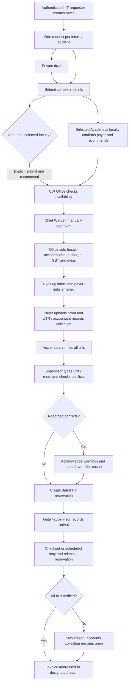

# Visitor Accommodation — Design Spec

> Redesign of the visitor/guest accommodation system (replaces the thin 3-state
> `VisitorRequest`). The sections below describe Case-1 (H2). Case-2 (H4) now
> uses a separate workflow and page; see the implemented H4 section at the end.

## 1. Scope & principle

A student requests hostel accommodation for visitors (Case-1: parents/siblings,
"Form H2"). The request runs a multi-stage workflow across several actors and
ends in a GST invoice. The **front half** of the workflow (eligibility,
recommendation, approval) varies by accommodation *type*; the **back half**
(payment → verify → allot → assign rooms → invoice) is universal. The variable
part is driven by an `AccommodationType` config row. H4 has a dedicated workflow
because its requester, faculty, payer and room override rules differ from H2.

## 2. Actors & roles

| Actor | Identity | Responsibility |
|---|---|---|
| Student | `Student` role, `@iiti.ac.in` only | Submit request, pay, download invoice |
| Faculty Advisor | **no account** — one-time email token | Recommend / decline |
| Chief Warden | `Admin` sub-role **`Chief Warden`** | Approve / request modification / reject |
| Chief Warden Office | `Admin` sub-role **`Chief Warden Office`** | Issue payment request, allot hostel |
| Accountant | `Admin` sub-role **`Accountant`** | Verify payment screenshot |
| Guest House Manager | reuse **`Hostel Supervisor`** | Assign actual rooms on arrival; daily PDF |
| Gate | existing **`Hostel Gate`** | Optional check-in / check-out |

The three Admin sub-roles are **not** in the Go authz catalog and need no catalog
version bump — exactly like the existing Admin sub-roles (HCU, Dean SA…). Admin
always gets every `route.admin.*`; per-queue visibility is handled in the UI and
endpoint guards via `req.user.subRole`.

## 3. Settings — `accommodation` config section

Stored as a `Configuration` key (`utils/configDefaults.js`), editable via the
existing admin Settings UI:

```
accommodation: {
  defaultPaymentLink: "",      // HCU payment URL (fallback)
  defaultPaymentQR:   "",      // QR image (storage fileRef or URL)
  feePerPersonPerNight: 0,     // base tariff
  gstPercentage: 0,            // 0 = no GST
  gstin: "",                   // shown on invoice if present
}
```

**Charge formula:** `subtotal = persons × nights × feePerPersonPerNight`,
`gst = subtotal × gstPercentage/100`, `total = subtotal + gst`. An
`AccommodationType` may override `feePerPersonPerNight` / `gstPercentage`.

## 4. Data model

### AccommodationType (extensibility lever — one row per category)
`key` (`parents-siblings` | `guest` | `intern`), `label`, `eligibleRequesterRoles`,
`requesterEmailDomain`, `approvalChain[]` (`{stage, action, approverSubRole,
viaToken, optional, autoAdvanceAfterHours}`), `requiredDocuments[]`,
`feePerPersonPerNight?`, `gstPercentage?`.

### AccommodationRequest (workflow instance)
`typeKey`, `requesterUserId`, applicant snapshot (name/phone/email),
`permanentAddress`, `addressProof {documentType, fileRef}`,
`guests[] {name, gender, relation?, aadharNumber?, remarks?}`,
`stay {fromDate, toDate, checkInTime, checkOutTime, earlyCheckInHours, lateCheckOutHours, purpose}`,
`persons`, `nights`,
`quote {persons, nights, feePerPersonPerNight, subtotal, gstPercentage, gstAmount, total}`,
`status`, `currentStage`, `stageDeadlineAt`,
`approvals[] {stage, action, actorUserId?, actorEmail?, reason?, at}`,
`payment {amount, paymentLink, qrRef, mode, status, screenshotFileRef, utr, paidAt, remarks, submittedAt, verifiedBy?, verifiedAt?, note?}`,
`allotment {hostelId, allottedBy, allottedAt}`,
`rooms[] {roomId, guestIndexes[]}`, `roomsAssignedBy`, `roomsAssignedAt`,
`checkInAt?`, `checkOutAt?`,
`invoice {number, pdfFileRef, gstApplicable, generatedAt, emailedAt}`,
`timeline[] {status, by?, at, note?}`.

Guest profiles reuse `VisitorProfile` conceptually; embedded here for simplicity.
`Appointments` (admin meetings) is untouched.

## 5. State machine

```
DRAFT → SUBMITTED ──▶ PENDING_CWO_CAPACITY      [every request is screened first]
PENDING_CWO_CAPACITY  (CW Office sees free guest beds per hostel for the dates)
  ├─ approve ─┬─ has facultyAdvisorEmail ─▶ PENDING_FA_RECOMMENDATION
  │           │        recommend ─▶ PENDING_CW_APPROVAL
  │           │        decline   ─▶ RETURNED_TO_STUDENT (revise & resubmit)
  │           └─ none ──────────▶ PENDING_CW_APPROVAL
  ├─ request modification ─▶ RETURNED_TO_STUDENT
  └─ reject (reason)      ─▶ REJECTED (terminal)
PENDING_CW_APPROVAL  (stageDeadlineAt = now+24h; hourly cron auto-approves)
  ├─ approve              ─▶ CW_APPROVED
  ├─ request modification ─▶ RETURNED_TO_STUDENT
  └─ reject (reason)      ─▶ REJECTED (terminal)
CW_APPROVED ─(CW Office sets the amount AND allots the hostel)─▶ PAYMENT_REQUESTED
    [form freezes, QR unlocks, beds committed — the ONLY hostel selection]
PAYMENT_REQUESTED
  ├─ pay now   (UTR + paid-on date + screenshot) ─▶ PAYMENT_SUBMITTED
  └─ pay later ─────────────────────────────────▶ PAYMENT_DEFERRED
PAYMENT_SUBMITTED
  ├─ accountant verify ─▶ PAYMENT_VERIFIED
  └─ accountant reject ─▶ PAYMENT_REQUESTED
PAYMENT_VERIFIED / PAYMENT_DEFERRED ─(supervisor assigns rooms — MANDATORY)─▶ ROOMS_ASSIGNED
ROOMS_ASSIGNED ─[optional gate]─▶ CHECKED_IN ─▶ CHECKED_OUT
… stay-end cron ─▶ INVOICED  (invoice only if the payment is verified)
CANCELLED: the student may cancel before payment is initiated; after payment is requested, only the Chief Warden / Chief Warden Office may cancel administratively.
```

New requests must be submitted at least **3 working days** before the check-in date (Monday–Friday; weekends are not counted).

A **deferred** bill is settled from the student's portal any time after room
assignment — including after the stay closes. That payment moves only
`payment.status` (the stay has already moved on), and the invoice is issued the
moment the accountant verifies it. A pay-now request is invoiced by the stay-end
sweep instead. The accountant's queue is therefore keyed on
`payment.status === "Submitted"`, not on the workflow status.

`HOSTEL_ALLOTTED` is legacy — allotment now happens with the payment request. It
remains in the enum, and transitions to `ROOMS_ASSIGNED`, so requests already at
that status when this shipped can still be completed.

Negative paths: **Request Modification** (→ RETURNED_TO_STUDENT, revisable) vs
**Reject** (→ REJECTED, terminal). Both require a reason. Chief Warden and Chief
Warden Office are strictly separate sub-roles.

### Stay window

A guest day runs **11:00 → 11:00**. `stay.fromDate`/`toDate` stay date-only (so a
night count can never shift with a timezone) and the times live beside them as
`checkInTime`/`checkOutTime`. Checking in before 11:00 or out after 11:00 is an
**extension**: `earlyCheckInHours`/`lateCheckOutHours` are derived and stored so
the hostel holds the room across them, but they do not change the charge.

## 6. Guest-room availability (mandatory room assignment)

Guest inventory = rooms with status **`Guest`** (see room-status work); bookable
bed count = the room's preserved `originalCapacity`. Guest occupancy is
**temporal**, computed from overlapping `AccommodationRequest.rooms[]`, never from
`Room.occupancy` (which stays for students).

```
availableGuestBeds(hostelId, from, to) =
  (guest beds in hostel) − (beds committed to other requests whose stay overlaps [from,to))
```

Rooms are booked **whole** — a party gets a room to itself rather than a bed in
a shared one — so the ROOM count is what limits how many bookings a hostel can
take; beds only decide whether a party fits inside the room it is given. The
allotment check therefore requires a free room AND enough beds.

Allotment happens inside a per-hostel distributed lock (`lock:accommodation:allot:<hostelId>`,
with a short retry). Availability is a read-then-write whose write lands on the
*request* document, so two offices allotting the last room touch different
documents and a transaction would not conflict — serialising per hostel is what
actually prevents the oversell.

- **Capacity + allotment** (CW Office): the screen shows free guest rooms per
  hostel for the requested dates.
- **ROOMS_ASSIGNED** (Supervisor): **required**; assigns specific guest room(s)/bed(s),
  validated against availability; populates room numbers for the daily PDF.
- Guard: a request reaching stay-end without rooms assigned is flagged, not invoiced.

## 7. Faculty Advisor — one-time token

Reuses `services/action-links` (single-use, expiring, `recipientEmail` for
non-logged-in parties; same pattern as complaint feedback).

- New token type `ACCOMMODATION_FA_RECOMMENDATION`, `subjectModel "AccommodationRequest"`,
  `recipientEmail = student.facultyAdvisorEmail`.
- Public routes (before `authenticate`): `GET/POST /api/accommodation/recommendation/:token`.
- `facultyAdvisorEmail` lives on `StudentProfile`, editable in student details.
- If a student has no `facultyAdvisorEmail`, the FA stage is skipped.

## 8. Scheduling (PM2-safe)

No cron lib today; add `node-cron`. Multi-core PM2 ⇒ duplicate jobs, so every
scheduled run is wrapped in a **Redis distributed lock** — generalize the existing
`withRefreshLock` (`services/cache/commonData.cache.js`) into a shared
`withLock(key, ttlSeconds, task)`. Lock keys are namespaced per job per window
(e.g. `lock:cron:daily-arrivals:<YYYY-MM-DD>`).

Jobs:
- hourly — 24h Chief Warden auto-approve sweep.
- daily 08:00 — per-hostel arrivals/departures PDF to supervisors.
- nightly — stay-end GST invoice generation (decoupled from the optional gate).

(Also retrofit the existing election voting dispatcher, which currently lacks a
lock and double-sends on multi-core.)

## 9. Supporting infra to add

- `node-cron` + shared `withLock()`.
- PDF service (`pdfkit`): daily arrivals list + GST invoice → stored via storage client.
- Quote/charge service (reads `accommodation` config + type override).
- ~12 templated emails in `email.service.js`.
- `ACCOMMODATION_FA_RECOMMENDATION` action-link token type.
- Guest-availability service over `Guest`-status rooms.

## 10. Frontend surfaces

- Student: multi-step request wizard (reuse `StepIndicator`) with live quote →
  status timeline → frozen form + QR payment section → invoice download.
- Chief Warden: approval queue. Chief Warden Office: payment + allotment consoles.
- Accountant: verification queue. Supervisor: arrival board + room assignment + daily PDF.
- Public: FA recommendation page `/accommodation/recommendation/:token`.

## 11. Build phases

1. **Foundation** — models, `accommodation` config, 3 Admin sub-roles, `facultyAdvisorEmail`. ← this phase
2. Front-half — submit (live quote), FA token, CW approve (24h auto), emails, student tracking.
3. Money — payment request/QR, screenshot upload, accountant verify, allotment.
4. Arrival & close — mandatory room assignment, availability service, gate, daily PDF, invoice.
5. Dedicated H4 intern/student workflow, described below.

## 12. Case-2: implemented H4 workflow

H4 has its own **Intern Accommodation** navigation item and role page at
`/<role>/intern-accommodation`. H2 and the legacy visitor pages retain their
existing workflows. The original visual plan is in
[the H4 flow diagrams](h4-accommodation/flow.html).



### Eligibility and visibility

- Requesters must be authenticated users with an `@iiti.ac.in` email. Any
  supported student/staff role can create its own requests.
- Recommending faculty are selected from current `Academics` users with an
  institutional email. Only the selected faculty can recommend. No email list,
  separate faculty account or HoD approval is needed.
- Interns may use external email. They do not receive an SMS login account.
- Drafts are private to their creator. Submitted requests are visible to the
  creator, designated faculty and the three accommodation desks. Supervisors
  and gates see requests in their assigned hostels after hostel allotment.
- Route access still respects administrator overrides. Node and Go authz
  catalogs both use version **19**.

### Request and payment behavior

The three-step form supports 1–100 students, CSV import, shared defaults,
incomplete drafts, review before submission and an explicit faculty self-
recommendation action. Every student gets an independent request under a batch
ID. The table supports student rows, search, pagination and grouping by batch,
faculty or creator within the current page. Multi-student decisions report
individual successes and failures; stale records do not prevent other rows
from being reviewed.

Faculty confirms whether the intern or faculty pays. CW Office sets the total
accommodation price for the stay and GST manually, selects the hostel and mess
option, and adds payment instructions. A zero charge requires a waiver reason.
The existing accommodation payment QR configuration is reused; office may also
enter a payment portal URL with the offer. Food
charges are handled separately and never added to accommodation invoices.

Payers submit a 12-digit UTR, payment date and PNG/JPG proof up to 5 MB. Uploaded
refs are registered against that request before submission; arbitrary media
refs are rejected. Accountant actions support verification, rejection,
recording reconciled collection, correcting references and marking a reversed
payment unpaid. All corrections require a reason. Deferring payment does not
unlock rooms. Payment state changes preserve an existing arrival/checkout
state.

### Room checks and reservations

The supervisor enters a room number and, where needed, unit/block number.
Duplicate room numbers require a unit. A real room in the allotted hostel is
required. Checks show current resident allocations, H2 bookings, legacy visitor
bookings, H4 reservations, room condition and possible capacity conflicts.
Resident assignment is explicitly described as a record of allocation, not
proof of physical presence during a holiday.

Conflicts are warnings. Assignment is allowed after an acknowledgement and
reason. The server repeats the check and compares its fingerprint before
saving; changed conflicts require a fresh check. Moves also require a reason
and retain room/check/override history.

H4 writes **AccommodationReservation**, never resident allocation or Room
occupancy/status/capacity. Reservations use exact IST arrival/departure times
and half-open intervals, so a room can be reused at the previous departure
time. H2 and legacy allocation remain restrictive and consult active H4
reservations. H2 date/time edits also reject newly overlapping H4 reservations.

Request revisions are checked inside MongoDB transactions. Shared Redis hostel
locks serialize H4 assignment, H2 assignment/date changes and legacy visitor
allocation. Transaction session reads are sequential. Redis failure prevents
allocation rather than permitting unchecked writes.

### Changes, closure and recovery

- Extensions/postponements go through faculty → office → Chief Warden. Office
  sets any extra charge; Chief Warden must recheck an assigned room for the new
  dates and acknowledge conflicts. The current reservation remains effective
  until approval. Additional bills require verification before assignment or
  arrival. Material identity/payer edits before the offer restart approvals;
  published financial details remain fixed.
- Cancellation releases the H4 reservation, retains payment records and stores
  an accounts/refund note. It does not process a refund or alter resident rooms.
- Gate/supervisor closure releases the reservation even if payment was later
  reversed. The hourly scheduler also closes ended stays at the configured IST
  departure time. Closed, fully paid stays receive a payer-addressed invoice.
- Invoice numbers use the existing shared serial counter. PDF storage failure
  leaves an invoice available through authenticated regeneration; interruption
  after number issuance does not allocate another number on retry. The hourly
  worker retries closed, settled requests awaiting final invoice status.
- Notifications are queued in the mutation transaction. A leased outbox worker
  runs each minute, retries failures with backoff and coalesces newer request
  revisions. Requests remain usable during SMTP failure; delivery errors appear
  in their details and a resend action is available.
- Intern and payer links are request-specific, expire after 30 days and are
  revocable. Intern links show stay information and permit date-change requests;
  payer links also expose payment submission, QR and invoice download. Public
  responses omit internal approvals, identities, proof refs and room warnings.
  Media and exports have separate request/desk access checks.

### Rollout and verification

Deploy the **Node backend, Go auth service and frontend together**. No data
rewrite or H2-to-H4 migration is required. MongoDB must run as a replica set;
Redis, Rust storage and the existing scheduler must be running. Allow normal
Mongoose index initialization for the three new collections (batches,
reservations and notifications). Configure `FRONTEND_URL`, storage credentials,
SMTP, accommodation payment QR and invoice GST details using existing
settings. Create/verify the CW Office, Chief Warden and Accountant sub-role
accounts and supervisors' assigned hostels. Test with institutional accounts
for requesters/faculty and an external intern address before production use.

Implementation lives in `src/apps/visitors/modules/intern-accommodation/` and
the corresponding frontend components/pages. API prefix:
`/api/v1/intern-accommodation`; public actions are under `/access/:token`.
Writes use `revision`; room commits also use `fingerprint`.

API integration tests cover eligibility and ownership, private partial drafts,
batch atomicity/partial review, manual approvals, expiring/revoked public links,
scoped proofs, extensions and extra bills, stale room previews, resident warning
overrides, exact time boundaries, H2 compatibility, late settlement, invoices
and notification lease/retry recovery. Tests disable SMTP and use isolated real
MongoDB/Redis. Real Rust storage and desktop/mobile browser flows were also
checked separately.
