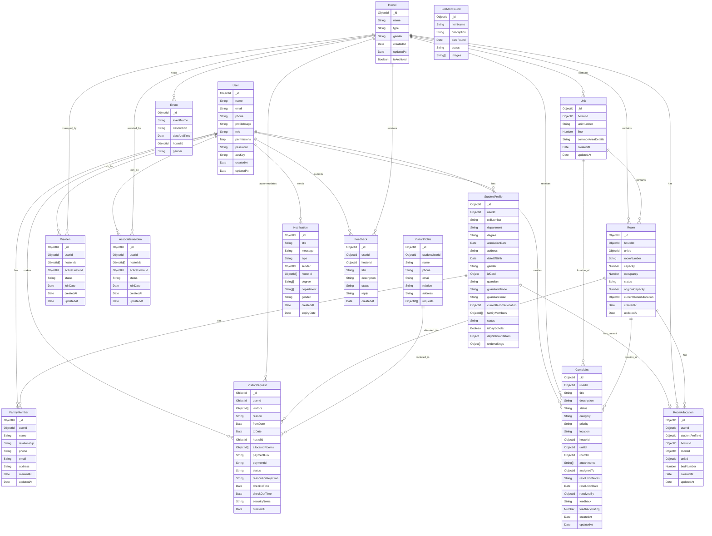

# Hostel Management System ER Diagram

```mermaid
erDiagram
    User {
        ObjectId _id
        String name
        String email
        String phone
        String profileImage
        String role
        Map permissions
        String password
        String aesKey
        Date createdAt
        Date updatedAt
    }

    StudentProfile {
        ObjectId _id
        ObjectId userId
        String rollNumber
        String department
        String degree
        Date admissionDate
        String address
        Date dateOfBirth
        String gender
        Object idCard
        String guardian
        String guardianPhone
        String guardianEmail
        ObjectId currentRoomAllocation
        ObjectId[] familyMembers
        String status
        Boolean isDayScholar
        Object dayScholarDetails
        Object[] undertakings
    }

    Hostel {
        ObjectId _id
        String name
        String type
        String gender
        Date createdAt
        Date updatedAt
        Boolean isArchived
    }

    Unit {
        ObjectId _id
        ObjectId hostelId
        String unitNumber
        Number floor
        String commonAreaDetails
        Date createdAt
        Date updatedAt
    }

    Room {
        ObjectId _id
        ObjectId hostelId
        ObjectId unitId
        String roomNumber
        Number capacity
        Number occupancy
        String status
        Number originalCapacity
        ObjectId currentRoomAllocation
        Date createdAt
        Date updatedAt
    }

    RoomAllocation {
        ObjectId _id
        ObjectId userId
        ObjectId studentProfileId
        ObjectId hostelId
        ObjectId roomId
        ObjectId unitId
        Number bedNumber
        Date createdAt
        Date updatedAt
    }

    Warden {
        ObjectId _id
        ObjectId userId
        ObjectId[] hostelIds
        ObjectId activeHostelId
        String status
        Date joinDate
        Date createdAt
        Date updatedAt
    }

    AssociateWarden {
        ObjectId _id
        ObjectId userId
        ObjectId[] hostelIds
        ObjectId activeHostelId
        String status
        Date joinDate
        Date createdAt
        Date updatedAt
    }

    Complaint {
        ObjectId _id
        ObjectId userId
        String title
        String description
        String status
        String category
        String priority
        String location
        ObjectId hostelId
        ObjectId unitId
        ObjectId roomId
        String[] attachments
        ObjectId assignedTo
        String resolutionNotes
        Date resolutionDate
        ObjectId resolvedBy
        String feedback
        Number feedbackRating
        Date createdAt
        Date updatedAt
    }

    Event {
        ObjectId _id
        String eventName
        String description
        Date dateAndTime
        ObjectId hostelId
        String gender
    }

    VisitorProfile {
        ObjectId _id
        ObjectId studentUserId
        String name
        String phone
        String email
        String relation
        String address
        ObjectId[] requests
    }

    VisitorRequest {
        ObjectId _id
        ObjectId userId
        ObjectId[] visitors
        String reason
        Date fromDate
        Date toDate
        ObjectId hostelId
        ObjectId[] allocatedRooms
        String paymentLink
        String paymentId
        String status
        String reasonForRejection
        Date checkInTime
        Date checkOutTime
        String securityNotes
        Date createdAt
    }

    LostAndFound {
        ObjectId _id
        String itemName
        String description
        Date dateFound
        String status
        String[] images
    }

    Notification {
        ObjectId _id
        String title
        String message
        String type
        ObjectId sender
        ObjectId[] hostelId
        String[] degree
        String[] department
        String gender
        Date createdAt
        Date expiryDate
    }

    FamilyMember {
        ObjectId _id
        ObjectId userId
        String name
        String relationship
        String phone
        String email
        String address
        Date createdAt
        Date updatedAt
    }

    Feedback {
        ObjectId _id
        ObjectId userId
        ObjectId hostelId
        String title
        String description
        String status
        String reply
        Date createdAt
    }

    User ||--o{ StudentProfile : has
    User ||--o{ Warden : can_be
    User ||--o{ AssociateWarden : can_be
    User ||--o{ Complaint : creates
    User ||--o{ VisitorRequest : makes
    User ||--o{ Feedback : submits
    User ||--o{ Notification : sends
    User ||--o{ FamilyMember : has

    StudentProfile ||--o{ FamilyMember : has
    StudentProfile ||--o| RoomAllocation : has_current

    Hostel ||--o{ Unit : contains
    Hostel ||--o{ Room : contains
    Hostel ||--o{ RoomAllocation : has
    Hostel ||--o{ Warden : managed_by
    Hostel ||--o{ AssociateWarden : assisted_by
    Hostel ||--o{ Complaint : receives
    Hostel ||--o{ Event : hosts
    Hostel ||--o{ VisitorRequest : accommodates
    Hostel ||--o{ Feedback : receives

    Unit ||--o{ Room : contains
    Unit ||--o{ Complaint : location_of

    Room ||--o{ RoomAllocation : has
    Room ||--o{ Complaint : location_of
    Room ||--o{ VisitorRequest : allocated_for

    VisitorProfile ||--o{ VisitorRequest : included_in
```
