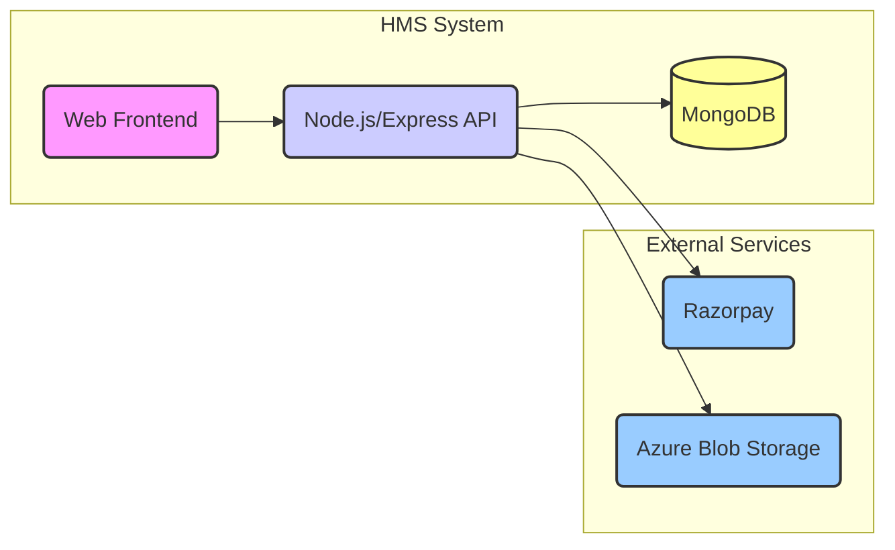

# Software Requirements Specification (SRS)

# Hostel Management System (HMS)

**Version:** 1.0
**Date:** 2024-08-02

## Table of Contents

1.  **[Introduction](#introduction)**
    1.1 [Purpose](#purpose)
    1.2 [Scope](#scope)
    1.3 [Definitions, Acronyms, and Abbreviations](#definitions-acronyms-and-abbreviations)
    1.4 [References](#references)
    1.5 [Overview](#overview)
2.  **[Overall Description](#overall-description)**
    2.1 [Product Perspective](#product-perspective)
    2.2 [Product Functions](#product-functions)
    2.3 [User Characteristics](#user-characteristics)
    2.4 [Constraints](#constraints)
    2.5 [Assumptions and Dependencies](#assumptions-and-dependencies)
3.  **[Specific Requirements](#specific-requirements)**
    3.1 [Functional Requirements](#functional-requirements)
    3.1.1 [Authentication and Authorization (`/api/auth`)](#311-authentication-and-authorization-apiauth)
    3.1.2 [Student Module (`/api/student`)](#312-student-module-apistudent)
    3.1.3 [Warden Module (`/api/warden`)](#313-warden-module-apiwarden)
    3.1.4 [Admin Module (`/api/admin`)](#314-admin-module-apiadmin)
    3.1.5 [Security Module (`/api/security`)](#315-security-module-apisecurity)
    3.1.6 [Super Admin Module (`/api/super-admin`)](#316-super-admin-module-apisuper-admin)
    3.1.7 [Complaint Management (`/api/complaint`)](#317-complaint-management-apicomplaint)
    3.1.8 [Lost and Found Management (`/api/lost-and-found`)](#318-lost-and-found-management-apilost-and-found)
    3.1.9 [Event Management (`/api/event`)](#319-event-management-apievent)
    3.1.10 [Hostel Management (`/api/hostel`)](#3110-hostel-management-apihostel)
    3.1.11 [Statistics and Reporting (`/api/stats`)](#3111-statistics-and-reporting-apistats)
    3.1.12 [Feedback Management (`/api/feedback`)](#3112-feedback-management-apifeedback)
    3.1.13 [File Upload Management (`/api/upload`)](#3113-file-upload-management-apiupload)
    3.1.14 [Visitor Management (`/api/visitor`)](#3114-visitor-management-apivisitor)
    3.1.15 [Notification Management (`/api/notification`)](#3115-notification-management-apinotificatio)
    3.1.16 [Disciplinary Committee (DisCo) Management (`/api/disCo`)](#3116-disciplinary-committee-disco-management-apidisco)
    3.1.17 [Payment Management (`/api/payment`)](#3117-payment-management-apipayment)
    3.1.18 [External API Integrations (`/external-api`)](#3118-external-api-integrations-external-api)
    3.2 [Non-Functional Requirements](#non-functional-requirements)
    3.2.1 [Performance](#321-performance)
    3.2.2 [Security](#322-security)
    3.2.3 [Usability](#323-usability)
    3.2.4 [Reliability](#324-reliability)
    3.2.5 [Maintainability](#325-maintainability)
    3.3 [Interface Requirements](#interface-requirements)
    3.3.1 [User Interfaces](#331-user-interfaces)
    3.3.2 [Software Interfaces](#332-software-interfaces)
    3.3.3 [Hardware Interfaces](#333-hardware-interfaces)
    3.3.4 [Communication Interfaces](#334-communication-interfaces)
    3.4 [Database Requirements](#database-requirements)

---

## 1. Introduction <a name="introduction"></a>

### 1.1 Purpose <a name="purpose"></a>

This document defines the Software Requirements Specification (SRS) for the Hostel Management System (HMS). The purpose of the HMS is to provide a centralized, web-based platform to manage various hostel operations efficiently, catering to the needs of students, wardens, administrative staff, security personnel, and super administrators.

### 1.2 Scope <a name="scope"></a>

The HMS will manage:

- User authentication and role-based access.
- Student information and activities (profile, complaints, fees, events).
- Warden responsibilities (student management, complaint handling, approvals).
- Administrative tasks (hostel setup, user management, fee configuration, reporting).
- Security operations (visitor logging).
- Super administrative oversight and configuration.
- Core hostel functions like complaint lodging, lost and found reporting, event scheduling, fee payments, visitor tracking, and notifications.
- Integration with external services for payments (Razorpay) and file storage (Azure Blob Storage).

### 1.3 Definitions, Acronyms, and Abbreviations <a name="definitions-acronyms-and-abbreviations"></a>

| Term/Acronym    | Definition                                                               |
| :-------------- | :----------------------------------------------------------------------- |
| **HMS**         | Hostel Management System                                                 |
| **SRS**         | Software Requirements Specification                                      |
| **Admin**       | Administrative staff managing hostel operations.                         |
| **Warden**      | Staff responsible for specific hostel blocks/floors and student welfare. |
| **Student**     | Resident of the hostel.                                                  |
| **Security**    | Personnel responsible for hostel security and visitor management.        |
| **Super Admin** | Top-level administrator with full system control.                        |
| **DisCo**       | Disciplinary Committee.                                                  |
| **JWT**         | JSON Web Token                                                           |
| **API**         | Application Programming Interface                                        |
| **UI**          | User Interface                                                           |
| **CRUD**        | Create, Read, Update, Delete                                             |
| **RBAC**        | Role-Based Access Control                                                |
| **ODM**         | Object Data Modeling                                                     |
| **GFM**         | GitHub Flavored Markdown                                                 |

### 1.4 References <a name="references"></a>

- Project Codebase (including `server.js`, `package.json`, route files)
- Node.js, Express.js, MongoDB, Mongoose documentation
- Razorpay API Documentation
- Azure Blob Storage Documentation

### 1.5 Overview <a name="overview"></a>

This SRS document is organized into three main sections: Introduction, Overall Description, and Specific Requirements. Section 1 provides the purpose, scope, and context. Section 2 gives a high-level overview of the product, its functions, users, and constraints. Section 3 details the specific functional, non-functional, interface, and database requirements.

---

## 2. Overall Description <a name="overall-description"></a>

### 2.1 Product Perspective <a name="product-perspective"></a>

The HMS is a self-contained, web-based application intended to replace or augment manual hostel management processes. It interfaces with external systems for payment processing (Razorpay) and cloud file storage (Azure Blob Storage). It operates using a standard client-server architecture with a web frontend interacting with a Node.js/Express.js backend API connected to a MongoDB database.



_Diagram: High-Level System Architecture_

### 2.2 Product Functions <a name="product-functions"></a>

The major functions provided by the HMS include:

- Secure user login and registration.
- Role-based dashboards and functionalities.
- Student profile management.
- Hostel and room information management.
- Online complaint registration and tracking.
- Lost and found item reporting and management.
- Event creation and notification.
- Online fee payment processing and history tracking.
- Visitor entry/exit logging.
- Feedback submission and viewing.
- System statistics and report generation.
- Notification delivery to users.
- Management of disciplinary actions.
- File uploads for various purposes (profiles, attachments).

### 2.3 User Characteristics <a name="user-characteristics"></a>

| User Role                     | Description                                                                                  | Technical Proficiency     |
| :---------------------------- | :------------------------------------------------------------------------------------------- | :------------------------ |
| **Students**                  | Residents needing access to personal info, hostel services, and communication channels.      | Basic Web Browsing Skills |
| **Wardens**                   | Staff managing students, addressing issues, and communicating notices within assigned areas. | Basic Web Browsing Skills |
| **Admin Staff**               | Users overseeing hostel operations, user management, finances, and system configuration.     | Basic Web Browsing Skills |
| **Security**                  | Personnel managing access control and logging visitor information.                           | Basic Web Browsing Skills |
| **Super Admin**               | Technical/high-level administrators for system-wide configuration, roles, multi-hostel mgmt. | Intermediate Web Skills   |
| **(Potential) DisCo Members** | Users needing access to view and record disciplinary cases.                                  | Basic Web Browsing Skills |

### 2.4 Constraints <a name="constraints"></a>

- **Runtime Environment:** Must support Node.js.
- **Connectivity:** Stable internet connection required for users and server.
- **Database:** MongoDB is the primary database.
- **File Storage:** Azure Blob Storage is required.
- **Payment Gateway:** Razorpay account is necessary.
- **Backend Framework:** Built using Express.js.
- **Authentication:** Relies on JWT.
- **Password Security:** Passwords hashed using bcrypt.

### 2.5 Assumptions and Dependencies <a name="assumptions-and-dependencies"></a>

- Users possess valid credentials for access.
- Underlying infrastructure (server, database, network) is reliable.
- External services (Razorpay, Azure) are available and functional.
- A frontend application consuming the API exists or will be developed separately.
- User-provided data is accurate to a reasonable extent.

---

## 3. Specific Requirements <a name="specific-requirements"></a>

### 3.1 Functional Requirements <a name="functional-requirements"></a>

#### 3.1.1 Authentication and Authorization (`/api/auth`) <a name="311-authentication-and-authorization-apiauth"></a>

- **FR1.1.1:** System shall allow new users (students, others based on workflow) to register.
- **FR1.1.2:** Registered users shall log in using credentials (e.g., email/username, password).
- **FR1.1.3:** System shall implement password hashing (bcrypt) for secure storage.
- **FR1.1.4:** System shall use JSON Web Tokens (JWT) for session management and API authentication.
- **FR1.1.5:** System shall implement role-based access control (RBAC) restricting access based on roles (Student, Warden, Admin, Security, Super Admin).
- **FR1.1.6:** System should provide a password recovery/reset mechanism.
- **FR1.1.7:** Users shall be able to log out.

#### 3.1.2 Student Module (`/api/student`) <a name="312-student-module-apistudent"></a>

- **FR1.2.1:** Students can view/update their profile.
- **FR1.2.2:** Students can view allocated hostel/room details.
- **FR1.2.3:** Students can submit complaints (See [3.1.7 Complaint Management](#317-complaint-management-apicomplaint)).
- **FR1.2.4:** Students can report lost/found items (See [3.1.8 Lost and Found Management](#318-lost-and-found-management-apilost-and-found)).
- **FR1.2.5:** Students can view upcoming events (See [3.1.9 Event Management](#319-event-management-apievent)).
- **FR1.2.6:** Students can view fee dues/payment history (See [3.1.17 Payment Management](#3117-payment-management-apipayment)).
- **FR1.2.7:** Students can submit feedback (See [3.1.12 Feedback Management](#3112-feedback-management-apifeedback)).
- **FR1.2.8:** Students can view relevant notifications (See [3.1.15 Notification Management](#3115-notification-management-apinotificatio)).

#### 3.1.3 Warden Module (`/api/warden`) <a name="313-warden-module-apiwarden"></a>

- **FR1.3.1:** Wardens can view details of supervised students.
- **FR1.3.2:** Wardens can manage/view room allocations in their jurisdiction.
- **FR1.3.3:** Wardens can view/manage assigned complaints (See [3.1.7 Complaint Management](#317-complaint-management-apicomplaint)).
- **FR1.3.4:** Wardens can manage lost/found items in their area (See [3.1.8 Lost and Found Management](#318-lost-and-found-management-apilost-and-found)).
- **FR1.3.5:** Wardens can post notices/announcements for their students.
- **FR1.3.6:** Wardens can view student feedback.
- **FR1.3.7:** Wardens receive relevant notifications (See [3.1.15 Notification Management](#3115-notification-management-apinotificatio)).

#### 3.1.4 Admin Module (`/api/admin`) <a name="314-admin-module-apiadmin"></a>

- **FR1.4.1:** Admins perform CRUD on user accounts (Students, Wardens, Security).
- **FR1.4.2:** Admins manage user roles and permissions.
- **FR1.4.3:** Admins manage hostel structure (blocks, rooms) (See [3.1.10 Hostel Management](#3110-hostel-management-apihostel)).
- **FR1.4.4:** Admins manage room allocations.
- **FR1.4.5:** Admins oversee complaint management (See [3.1.7 Complaint Management](#317-complaint-management-apicomplaint)).
- **FR1.4.6:** Admins oversee lost and found system (See [3.1.8 Lost and Found Management](#318-lost-and-found-management-apilost-and-found)).
- **FR1.4.7:** Admins manage system-wide events/announcements (See [3.1.9 Event Management](#319-event-management-apievent)).
- **FR1.4.8:** Admins manage fee structures/monitor payments (See [3.1.17 Payment Management](#3117-payment-management-apipayment)).
- **FR1.4.9:** Admins view statistics/generate reports (See [3.1.11 Statistics and Reporting](#3111-statistics-and-reporting-apistats)).
- **FR1.4.10:** Admins manage feedback responses (See [3.1.12 Feedback Management](#3112-feedback-management-apifeedback)).
- **FR1.4.11:** Admins manage system notifications (See [3.1.15 Notification Management](#3115-notification-management-apinotificatio)).
- **FR1.4.12:** Admins oversee disciplinary actions (See [3.1.16 Disciplinary Committee Management](#3116-disciplinary-committee-disco-management-apidisco)).

#### 3.1.5 Security Module (`/api/security`) <a name="315-security-module-apisecurity"></a>

- **FR1.5.1:** Security personnel log visitor entries/exits (See [3.1.14 Visitor Management](#3114-visitor-management-apivisitor)).
- **FR1.5.2:** Security personnel view recent visitor activity log.
- **FR1.5.3:** (Optional) Security might manage student check-in/check-out logs.

#### 3.1.6 Super Admin Module (`/api/super-admin`) <a name="316-super-admin-module-apisuper-admin"></a>

- **FR1.6.1:** Super Admins have all Admin privileges.
- **FR1.6.2:** Super Admins manage Admin accounts.
- **FR1.6.3:** Super Admins manage system-level configurations (e.g., integration keys, core settings).
- **FR1.6.4:** Super Admins may have oversight across multiple hostel instances.

#### 3.1.7 Complaint Management (`/api/complaint`) <a name="317-complaint-management-apicomplaint"></a>

- **FR1.7.1:** Students submit complaints (category, description, optional attachment via [3.1.13 File Upload](#3113-file-upload-management-apiupload)).
- **FR1.7.2:** Users view complaints based on role/permissions.
- **FR1.7.3:** System tracks complaint status (e.g., Submitted, In Progress, Resolved, Rejected).
- **FR1.7.4:** Admins/Wardens update status and add comments/resolution notes.
- **FR1.7.5:** System may automatically assign complaints to relevant Wardens.

#### 3.1.8 Lost and Found Management (`/api/lost-and-found`) <a name="318-lost-and-found-management-apilost-and-found"></a>

- **FR1.8.1:** Users report lost items (description, location).
- **FR1.8.2:** Users report found items (description, location, optional image via [3.1.13 File Upload](#3113-file-upload-management-apiupload)).
- **FR1.8.3:** Wardens/Admins manage found item inventory.
- **FR1.8.4:** System provides search/browse for lost/found items.
- **FR1.8.5:** Wardens/Admins mark items as claimed/returned.

#### 3.1.9 Event Management (`/api/event`) <a name="319-event-management-apievent"></a>

- **FR1.9.1:** Admins/Wardens create events (name, date, time, location, description).
- **FR1.9.2:** Students view upcoming/past events.
- **FR1.9.3:** (Optional) System may allow event registration.

#### 3.1.10 Hostel Management (`/api/hostel`) <a name="3110-hostel-management-apihostel"></a>

- **FR1.10.1:** Admins define hostel blocks/buildings.
- **FR1.10.2:** Admins define rooms within blocks (number, capacity, type).
- **FR1.10.3:** Admins/Wardens manage room allocation to students.
- **FR1.10.4:** System maintains room occupancy status.

#### 3.1.11 Statistics and Reporting (`/api/stats`) <a name="3111-statistics-and-reporting-apistats"></a>

- **FR1.11.1:** Admins/Super Admins view dashboard statistics (e.g., occupancy, complaints, fees).
- **FR1.11.2:** System generates reports (e.g., student lists, defaulters, complaint summaries).

#### 3.1.12 Feedback Management (`/api/feedback`) <a name="3112-feedback-management-apifeedback"></a>

- **FR1.12.1:** Students submit feedback on services/facilities.
- **FR1.12.2:** Admins/Wardens view submitted feedback.
- **FR1.12.3:** (Optional) Admins categorize/respond to feedback.

#### 3.1.13 File Upload Management (`/api/upload`) <a name="3113-file-upload-management-apiupload"></a>

- **FR1.13.1:** System allows relevant file uploads (profile pics, attachments, item images).
- **FR1.13.2:** Files stored securely using Azure Blob Storage (See [3.3.2 Software Interfaces](#332-software-interfaces)).
- **FR1.13.3:** System handles file size limits and allowed types.

#### 3.1.14 Visitor Management (`/api/visitor`) <a name="3114-visitor-management-apivisitor"></a>

- **FR1.14.1:** Security records visitor details (name, contact, purpose, student visited, time in).
- **FR1.14.2:** Security records visitor checkout time.
- **FR1.14.3:** Admins/Security view visitor logs.

#### 3.1.15 Notification Management (`/api/notification`) <a name="3115-notification-management-apinotificatio"></a>

- **FR1.15.1:** System generates notifications for events (new complaint, status update, event, fee reminder).
- **FR1.15.2:** Users view notifications within the application.
- **FR1.15.3:** Notifications targeted based on user role/context.

#### 3.1.16 Disciplinary Committee (DisCo) Management (`/api/disCo`) <a name="3116-disciplinary-committee-disco-management-apidisco"></a>

- **FR1.16.1:** Authorized users (Admin/DisCo) record student disciplinary incidents.
- **FR1.16.2:** Authorized users view student disciplinary history.
- **FR1.16.3:** System securely stores disciplinary records.

#### 3.1.17 Payment Management (`/api/payment`) <a name="3117-payment-management-apipayment"></a>

- **FR1.17.1:** System displays fee structures/dues to students.
- **FR1.17.2:** System integrates with Razorpay for online payments (See [3.3.2 Software Interfaces](#332-software-interfaces)).
- **FR1.17.3:** System securely handles payment transactions/confirmations.
- **FR1.17.4:** Students view payment history.
- **FR1.17.5:** Admins track payment status/manage fee records.

#### 3.1.18 External API Integrations (`/external-api`) <a name="3118-external-api-integrations-external-api"></a>

- **FR1.18.1:** System provides/consumes external APIs as needed (e.g., integration with a central student information system). _[Requires further definition]_

### 3.2 Non-Functional Requirements <a name="non-functional-requirements"></a>

| Category            | Requirement ID | Description                                                                                       |
| :------------------ | :------------- | :------------------------------------------------------------------------------------------------ |
| **Performance**     | NFR1.1         | Common read API responses within 2s under normal load.                                            |
|                     | NFR1.2         | User login within 3s.                                                                             |
|                     | NFR1.3         | Support [Specify Number, e.g., 100] concurrent users without significant performance degradation. |
| **Security**        | NFR2.1         | All client-server communication via HTTPS.                                                        |
|                     | NFR2.2         | Passwords securely hashed (bcrypt).                                                               |
|                     | NFR2.3         | JWTs for session management/API auth (secure handling, appropriate expiry).                       |
|                     | NFR2.4         | Strict RBAC enforced for all API endpoints.                                                       |
|                     | NFR2.5         | Input validation against injection attacks (NoSQL Injection, XSS).                                |
|                     | NFR2.6         | Dependencies kept up-to-date.                                                                     |
|                     | NFR2.7         | Sensitive config (API keys, DB creds) stored securely (e.g., `.env`), not in version control.     |
|                     | NFR2.8         | File uploads scanned for malware (if possible), restricted by type/size.                          |
| **Usability**       | NFR3.1         | (Separate) UI should be intuitive and easy to navigate for all roles.                             |
|                     | NFR3.2         | Consistent terminology and layout in UI.                                                          |
|                     | NFR3.3         | Clear and informative error messages.                                                             |
| **Reliability**     | NFR4.1         | Aim for high availability (e.g., 99.5% uptime).                                                   |
|                     | NFR4.2         | Regular database backups implemented.                                                             |
|                     | NFR4.3         | Proper backend error handling and logging.                                                        |
| **Maintainability** | NFR5.1         | Code follows consistent standards, well-documented where necessary.                               |
|                     | NFR5.2         | Modular structure (routes, controllers, models) maintained.                                       |

### 3.3 Interface Requirements <a name="interface-requirements"></a>

#### 3.3.1 User Interfaces <a name="331-user-interfaces"></a>

- Primary interface: Web-based graphical user interface (GUI) (developed separately).
- Responsiveness: UI functions on common browsers (Chrome, Firefox, Safari, Edge) and screen sizes (desktop, tablet, mobile).

#### 3.3.2 Software Interfaces <a name="332-software-interfaces"></a>

| Interface Type       | System/Technology                            | Purpose                        | Reference                                                                        |
| :------------------- | :------------------------------------------- | :----------------------------- | :------------------------------------------------------------------------------- |
| **Database**         | MongoDB                                      | Primary data storage           | [3.4 Database Requirements](#database-requirements)                              |
| **ODM**              | Mongoose                                     | Data modeling & interaction    | [3.4 Database Requirements](#database-requirements)                              |
| **Payment Gateway**  | Razorpay API                                 | Process online payments        | [3.1.17 Payment Management](#3117-payment-management-apipayment)                 |
| **File Storage**     | Azure Blob Storage API                       | Store uploaded files           | [3.1.13 File Upload](#3113-file-upload-management-apiupload)                     |
| **Operating System** | Node.js compatible (Linux, Win Server, etc.) | Host backend application       | [2.4 Constraints](#constraints)                                                  |
| **External APIs**    | TBD                                          | Integration with other systems | [3.1.18 External API Integrations](#3118-external-api-integrations-external-api) |

#### 3.3.3 Hardware Interfaces <a name="333-hardware-interfaces"></a>

- None defined beyond standard web server and client hardware.

#### 3.3.4 Communication Interfaces <a name="334-communication-interfaces"></a>

- **Protocol:** HTTPS for client-server communication.
- **API Style:** RESTful principles using JSON.
- **Cross-Origin:** CORS configured for specific frontend origins.

### 3.4 Database Requirements <a name="database-requirements"></a>

- **DBR1:** DBMS: MongoDB.
- **DBR2:** ODM: Mongoose for data modeling/interaction.
- **DBR3:** Schema: Must support storing data for users (roles), hostels, rooms, students, complaints, lost/found, events, payments, visitors, notifications, feedback, disciplinary actions, configurations.
- **DBR4:** Indexing: Create indexes on frequently queried fields (e.g., user emails, student IDs, complaint status) for performance.
- **DBR5:** Integrity: Maintain data integrity (e.g., ensure student belongs to a valid room).

```mermaid
erDiagram
    USER ||--o{ ROLE : has
    USER ||--o{ NOTIFICATION : receives
    STUDENT ||--|| USER : is
    WARDEN ||--|| USER : is
    ADMIN ||--|| USER : is
    SECURITY ||--|| USER : is
    SUPER_ADMIN ||--|| USER : is

    HOSTEL ||--|{ ROOM : contains
    ROOM ||--o{ STUDENT : allocates

    STUDENT ||--|{ COMPLAINT : submits
    STUDENT ||--|{ LOST_FOUND_ITEM : reports
    STUDENT ||--|{ PAYMENT : makes
    STUDENT ||--|{ FEEDBACK : gives
    STUDENT ||--o{ VISITOR_LOG : is_visited_by
    STUDENT ||--|{ DISCIPLINARY_RECORD : involved_in

    WARDEN ||--o{ COMPLAINT : manages
    WARDEN ||--o{ LOST_FOUND_ITEM : manages
    WARDEN ||--o{ EVENT : creates

    ADMIN ||--o{ USER : manages_users
    ADMIN ||--o{ HOSTEL : manages
    ADMIN ||--o{ ROOM : manages
    ADMIN ||--o{ COMPLAINT : oversees
    ADMIN ||--o{ LOST_FOUND_ITEM : oversees
    ADMIN ||--o{ EVENT : manages
    ADMIN ||--o{ PAYMENT : tracks
    ADMIN ||--o{ FEEDBACK : views
    ADMIN ||--o{ VISITOR_LOG : views
    ADMIN ||--o{ NOTIFICATION : manages
    ADMIN ||--o{ DISCIPLINARY_RECORD : manages

    SECURITY ||--|{ VISITOR_LOG : logs

    DISCO_MEMBER ||--|| USER : is
    DISCO_MEMBER ||--o{ DISCIPLINARY_RECORD : records

    COMPLAINT ||--o{ USER : assigned_to (optional)
    EVENT ||--o{ USER : created_by

    %% Simplified relationships - details like mandatory/optional (|, o) and cardinality ({, o) are indicative.
    %% This is a high-level overview for the SRS.
```

_Diagram: High-Level Database Entity Relationships_

---
