## Software Requirements Specification (SRS)

### Hostel Management System (HMS) – Backend API

Version: 3.0  
Date: 2026-01-08

### Revision History

- 1.0 (2025-06-10): Initial SRS
- 2.0 (2025-08-10): Fully revised to match implemented backend: session-based auth, RBAC/permissions, Razorpay payments, external API, deployment and detailed diagrams
- 3.0 (2026-01-08): Comprehensive update with Socket.io (real-time), Redis adapter, Face Scanner (automated attendance), Leave Management, Certificates, Undertakings, and Spreadsheet-view data APIs.

## Table of Contents

1. Introduction
   - 1.1 Purpose
   - 1.2 Scope
   - 1.3 Definitions, Acronyms, Abbreviations
   - 1.4 References
   - 1.5 Overview
2. Overall Description
   - 2.1 Product Perspective
   - 2.2 Architectural Overview (with diagrams)
   - 2.3 Product Functions
   - 2.4 User Characteristics
   - 2.5 Constraints
   - 2.6 Assumptions and Dependencies
3. Detailed Architecture
   - 3.1 Runtime and Deployment Architecture
   - 3.2 Request Lifecycle and Middleware Order
   - 3.3 Authentication and Session Management (incl. SSO)
   - 3.4 Authorization and RBAC Permissions Model
   - 3.5 Real-time Communication (Socket.io & Redis)
   - 3.6 File Uploads and Storage (Local)
   - 3.7 Payments (Razorpay)
   - 3.8 Face Scanner Integration
   - 3.9 Configuration Management
   - 3.10 Logging and Error Handling
   - 3.11 Security Posture
4. Functional Requirements
   - 4.1 Auth & Session
   - 4.2 Real-time Features
   - 4.3 Core Modules (Student, Warden, Admin, Security, Super Admin)
   - 4.4 Supporting Modules (Complaints, Lost & Found, Events, Visitors, Feedback, Notifications, Stats, Inventory, Tasks, Undertakings, Leave, Certificates, Face Scanner)
   - 4.5 Payments
   - 4.6 Uploads
   - 4.7 External API
5. Non-Functional Requirements
6. Interface Requirements
   - 6.1 Software Interfaces
   - 6.2 Communication Interfaces
7. Data Model & Database Requirements
   - 7.1 Data Entities Overview
   - 7.2 Key Schemas
   - 7.3 Indexing & Integrity
   - 7.4 ER Diagram
8. API Surface Overview
   - 8.1 Route Namespaces
   - 8.2 High-Level Route Map (diagram)
9. Appendices

---

## 1. Introduction

### 1.1 Purpose

This SRS defines the backend API for the Hostel Management System (HMS). It captures implemented behavior and design so engineering, QA, security, and stakeholders share a single, accurate reference.

### 1.2 Scope

Backend API built with Node.js and Express, using MongoDB via Mongoose. It supports:

- Authentication (email/password, Google) and server-side sessions
- Single Sign-On (SSO) integration via JWT tokens
- Real-time communication via Socket.io with Redis adapter
- Role-based access and fine-grained permissions
- Automated attendance tracking via Face Scanners
- Student, Warden, Admin, Security, Super Admin modules
- Complaints, Lost & Found, Events, Visitors, Feedback, Notifications, Stats, Leave, Certificates
- Hostel/Rooms (with spreadsheet-view API), Inventory, Tasks, Undertakings, Staff attendance, Family members
- File uploads to local filesystem
- Razorpay payment link creation and status checks
- External API namespace for integrations

### 1.3 Definitions, Acronyms, Abbreviations

- HMS: Hostel Management System
- RBAC: Role-Based Access Control
- CORS: Cross-Origin Resource Sharing
- TTL: Time To Live (expiry)
- SSO: Single Sign-On

### 1.4 References

- Codebase: `server.js`, `routes/*`, `controllers/*`, `models/*`, `middlewares/*`, `externalApi/*`, `config/socket.js`, `utils/socketHandlers.js`
- Express, Mongoose, connect-mongo, express-session, Socket.io, Redis
- Razorpay Node SDK

### 1.5 Overview

The document explains architecture and behavior first, then enumerates requirements, interfaces, and data models with diagrams.

---

## 2. Overall Description

### 2.1 Product Perspective

The API is the central service in a client–server architecture. A separate frontend consumes REST endpoints over HTTPS and maintains real-time connections via WebSockets. Data persists in MongoDB; sessions are stored in MongoDB via `connect-mongo`. Redis is used for Socket.io distribution and real-time online user tracking.

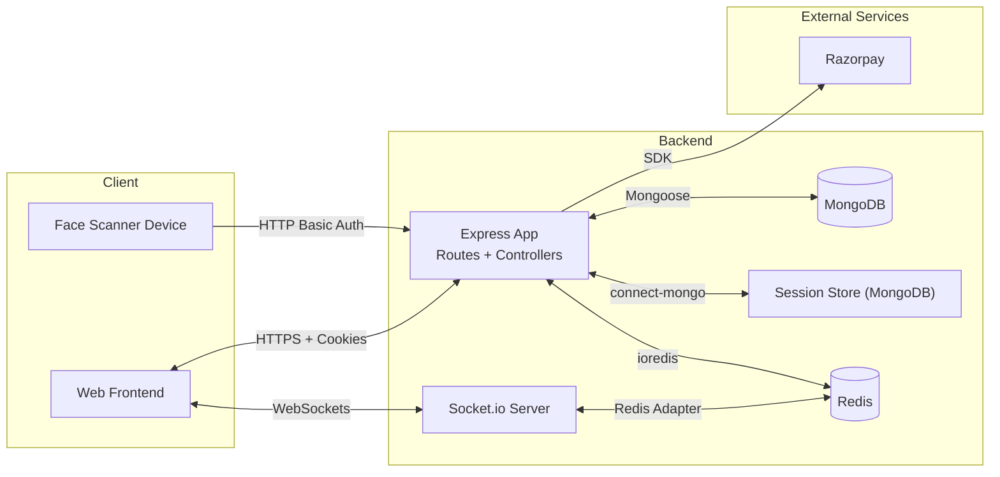
```mermaid
graph LR
  subgraph Client
    FE["Web Frontend"]
    SC["Face Scanner Device"]
  end

  subgraph Backend
    EX["Express App<br/>Routes + Controllers"]
    SIO["Socket.io Server"]
    MS[(MongoDB)]
    SS["Session Store (MongoDB)"]
    RD[(Redis)]
    end

  subgraph External Services
    RZP[Razorpay]
  end

  FE <--> |HTTPS + Cookies| EX
  FE <--> |WebSockets| SIO
  SC --> |HTTP Basic Auth| EX
  EX <--> |Mongoose| MS
  EX <--> |connect-mongo| SS
  SIO <--> |Redis Adapter| RD
  EX <--> |ioredis| RD
  EX --> |SDK| RZP
```

### 2.2 Architectural Overview (with diagrams)

#### Deployment View

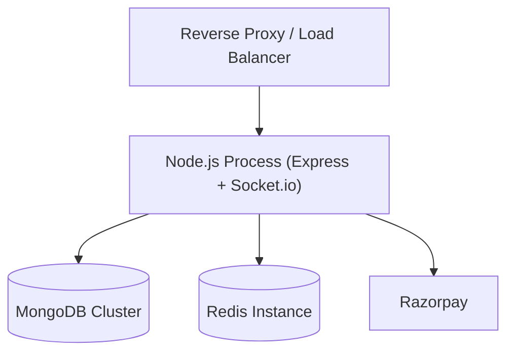
```mermaid
graph TD
  LB["Reverse Proxy / Load Balancer"]
  APP["Node.js Process (Express + Socket.io)"]
  DB[("MongoDB Cluster")]
  RD[("Redis Instance")]
  RZP[Razorpay]

  LB --> APP
  APP --> DB
  APP --> RD
  APP --> RZP
```

#### Request Lifecycle & Middleware Order

As implemented in `server.js`:

1. express.urlencoded → cookieParser → Session-specific CORS (if SSO/Scanner) → Regular CORS (with credentials) → express-session (connect-mongo) → static `/uploads` (if local) → mount `/api/upload` → express.json → mount remaining routes

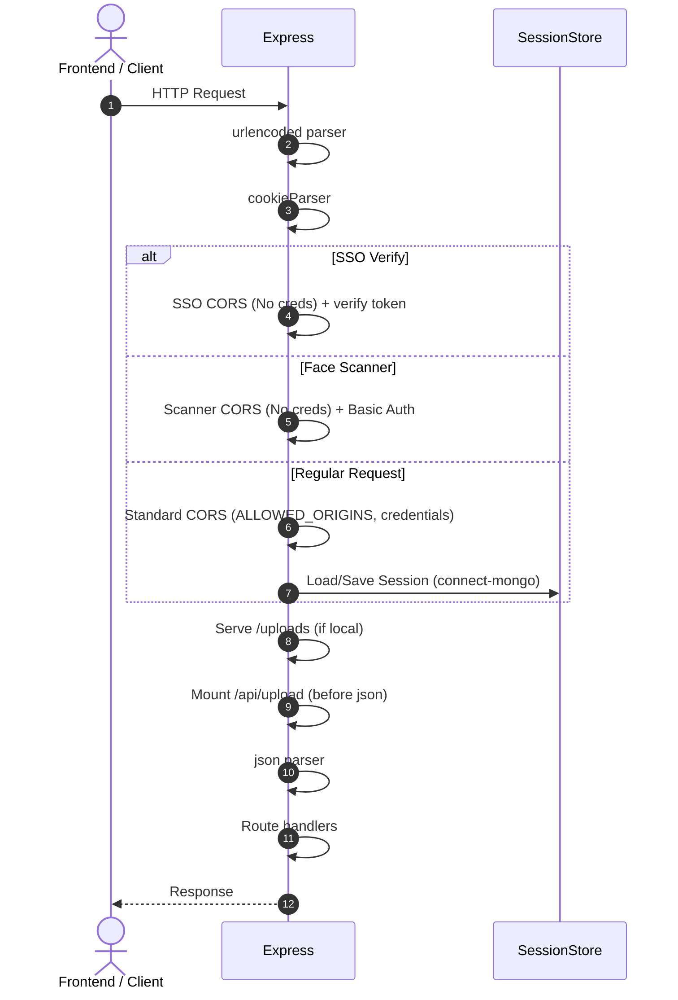
```mermaid
sequenceDiagram
  autonumber
  actor FE as Frontend / Client
  participant EX as Express
  participant SES as SessionStore

  FE->>EX: HTTP Request
  EX->>EX: urlencoded parser
  EX->>EX: cookieParser
  alt SSO Verify
    EX->>EX: SSO CORS (No creds) + verify token
  else Face Scanner
    EX->>EX: Scanner CORS (No creds) + Basic Auth
  else Regular Request
    EX->>EX: Standard CORS (ALLOWED_ORIGINS, credentials)
    EX->>SES: Load/Save Session (connect-mongo)
  end
  EX->>EX: Serve /uploads (if local)
  EX->>EX: Mount /api/upload (before json)
  EX->>EX: json parser
  EX->>EX: Route handlers
  EX-->>FE: Response
```

### 2.3 Product Functions

- Server-side session login (email/password, Google)
- RBAC by role plus permission map
- Real-time updates via Socket.io (online status, notifications)
- Automated Face Scanner processing for gate attendance
- CRUD around students, rooms, hostels, visitors, lost & found, complaints, events, leave, certificates, undertakings
- File upload for profile images, student ID cards, and certificates
- Razorpay payment link creation and status fetch
- External API namespace for integrations

### 2.4 User Characteristics

- Students: Basic web skills
- Wardens/Admin/Security: Basic web skills
- Super Admin: Intermediate (system configuration)
- Face Scanner: Embedded device client

### 2.5 Constraints

- Node.js runtime, Express framework, Socket.io
- MongoDB database (Disk)
- Redis database (Memory - for real-time state)
- Razorpay account/keys for payments

### 2.6 Assumptions and Dependencies

- Valid user accounts exist (provisioned via Admin flows)
- External services (Razorpay, Redis) are reachable
- Frontend is hosted with allowed origins configured

---

## 3. Detailed Architecture

### 3.1 Runtime and Deployment Architecture

- Single Express application (`server.js`) mounting routers under `/api/*` and `/external-api`
- Session management using `express-session` with `connect-mongo` store
- Real-time layer using `Socket.io` with `redis-adapter` for scaling across multiple instances.
- Sessions TTL: 7 days; cookies `httpOnly`, `secure` in non-dev, `sameSite` None in non-dev

### 3.2 Request Lifecycle and Middleware Order

See sequence above. The upload routes are mounted before `express.json()` to support multipart handling via `multer` memory storage. Specialized CORS handlers exist for SSO and Face Scanner routes to bypass credential requirements where necessary.

### 3.3 Authentication and Session Management

- Email/password login: `POST /api/auth/login`
- Google login: `POST /api/auth/google` (verifies id_token with Google)
- SSO: `GET /api/sso/redirect` (signs JWT) and `POST /api/sso/verify` (verifies JWT)

- Current user: `GET /api/auth/user` (requires session)
- Logout: `GET /api/auth/logout` (destroys session and clears cookie)
- Refresh user data: `GET /api/auth/refresh`
- Device sessions listing and remote logout: `GET /api/auth/user/devices`, `POST /api/auth/user/devices/logout/:sessionId`

Session details:

- On successful login/Google: `req.session.userId`, `role`, `email`, and an `userData` cache with `_id, email, role, permissions (object), hostel`
- A `Session` collection tracks device sessions (`userId`, `sessionId`, user agent, ip, device name, login/lastActive`)

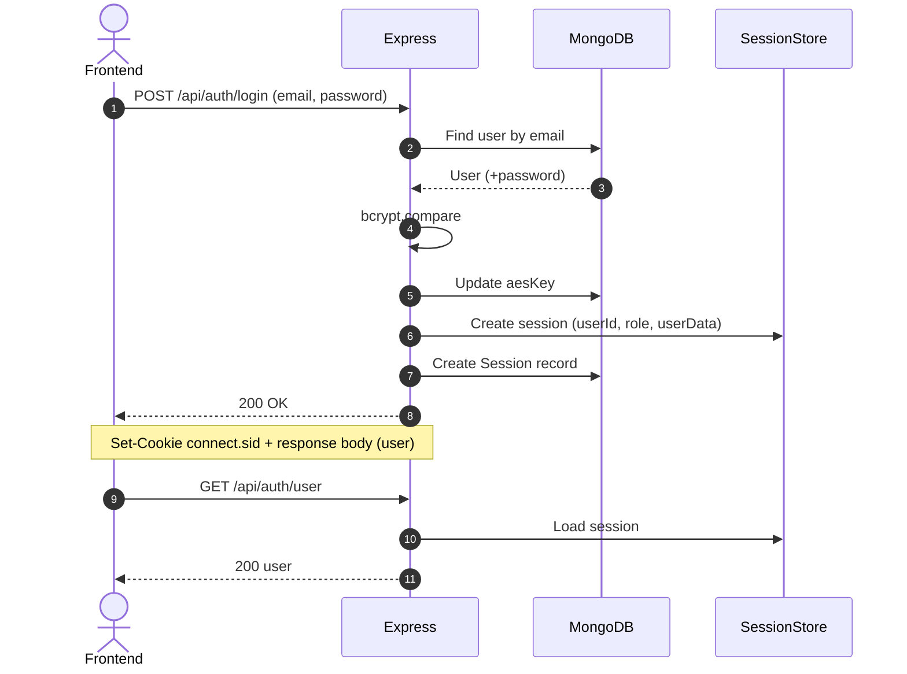
```mermaid
sequenceDiagram
  autonumber
  actor FE as Frontend
  participant EX as Express
  participant DB as MongoDB
  participant SS as SessionStore

  FE->>EX: POST /api/auth/login (email, password)
  EX->>DB: Find user by email
  DB-->>EX: User (+password)
  EX->>EX: bcrypt.compare
  EX->>DB: Update aesKey
  EX->>SS: Create session (userId, role, userData)
  EX->>DB: Create Session record
  EX-->>FE: 200 OK
  Note over EX,FE: Set-Cookie connect.sid + response body (user)

  FE->>EX: GET /api/auth/user
  EX->>SS: Load session
  EX-->>FE: 200 user
```

### 3.4 Authorization and RBAC Permissions Model

- Roles: `Student`, `Maintenance Staff`, `Warden`, `Associate Warden`, `Admin`, `Security`, `Super Admin`, `Hostel Supervisor`, `Hostel Gate`
- Role checks via `authorizeRoles([...])`
- Fine-grained permissions via a Map on `User.permissions`, with resources like `students_info`, `lost_and_found`, `events`, `visitors`, `complaints`, `feedback`, `rooms`, `hostels`, `users`, etc., each with actions `view|edit|create|delete|react`
- Middleware `requirePermission(resource, action)` uses `hasPermission` to allow/deny

```mermaid
flowchart LR
  A([Request]) --> B{Authenticated?}
  B -- No --> X[[401 Unauthorized]]
  B -- Yes --> C{Role Allowed?}
  C -- No --> Y[[403 Forbidden]]
  C -- Yes --> D{Permission Check?}
  D -- Not required --> Z[[Proceed]]
  D -- Required --> E{hasPermission}
  E -- True --> Z[[Proceed]]
  E -- False --> Y[[403 Forbidden]]
```

#### 3.4.1 Role-wise Access Diagrams

The following diagrams illustrate the typical resource access per role (summarized from default permissions). They are indicative; custom permissions can override defaults.

Student (defaults overview)

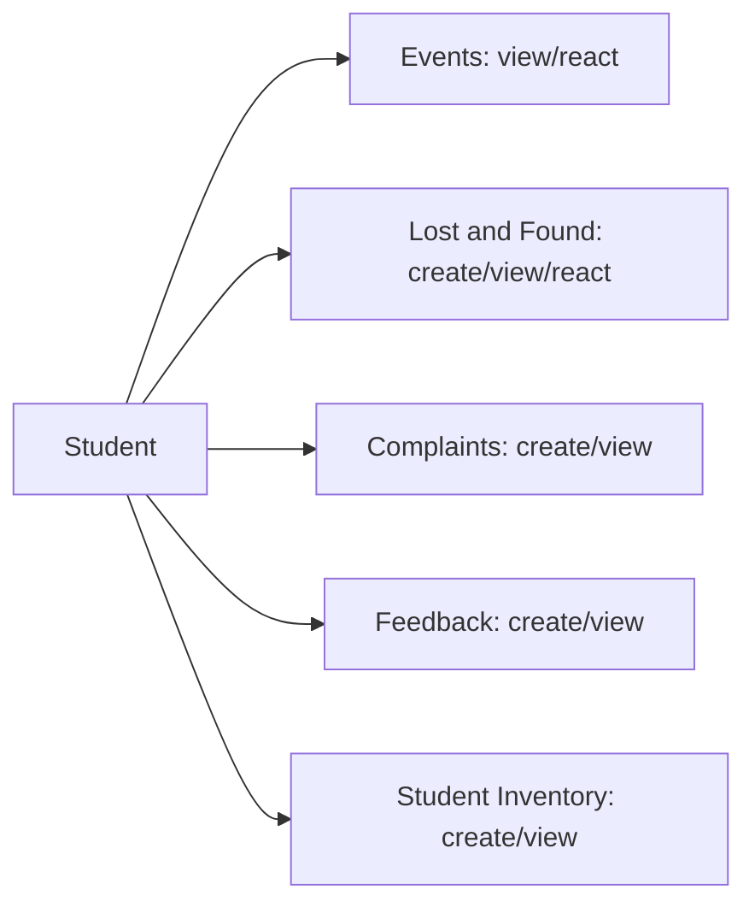
```mermaid
graph LR
  STU[Student]
  STU --> EV["Events: view/react"]
  STU --> LAF["Lost and Found: create/view/react"]
  STU --> CMP["Complaints: create/view"]
  STU --> FB["Feedback: create/view"]
  STU --> SINV["Student Inventory: create/view"]
```

Warden (defaults overview)

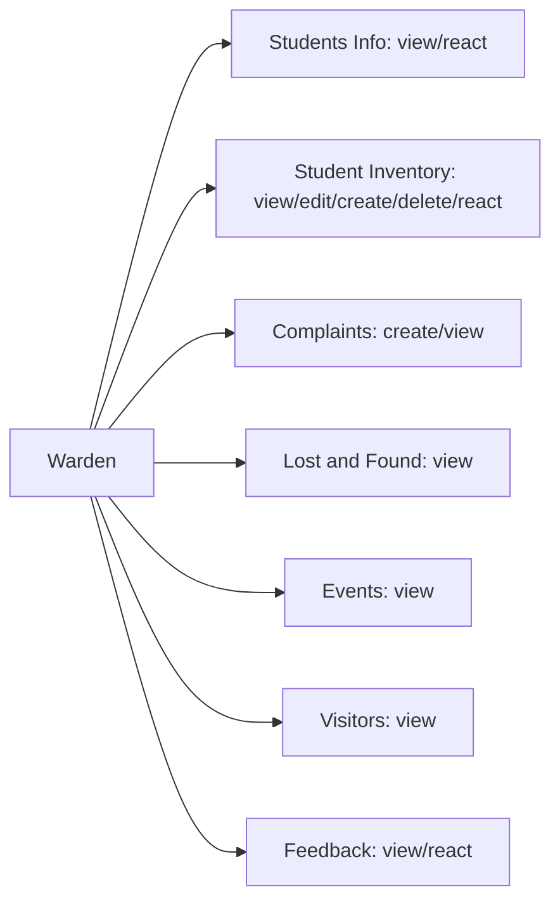
```mermaid
graph LR
  WAR[Warden]
  WAR --> STINF["Students Info: view/react"]
  WAR --> SINV["Student Inventory: view/edit/create/delete/react"]
  WAR --> CMP["Complaints: create/view"]
  WAR --> LAF["Lost and Found: view"]
  WAR --> EV["Events: view"]
  WAR --> VIS["Visitors: view"]
  WAR --> FB["Feedback: view/react"]
```

Admin (defaults overview)

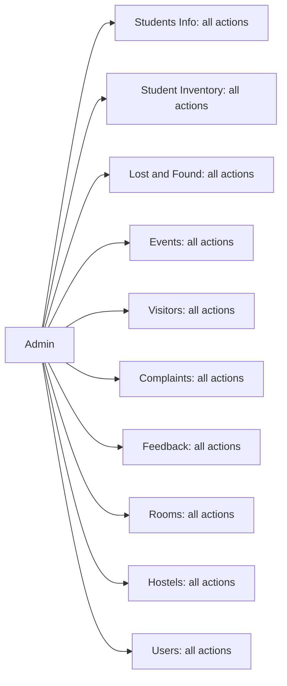
```mermaid
graph LR
  ADM[Admin]
  ADM --> STINF["Students Info: all actions"]
  ADM --> SINV["Student Inventory: all actions"]
  ADM --> LAF["Lost and Found: all actions"]
  ADM --> EV["Events: all actions"]
  ADM --> VIS["Visitors: all actions"]
  ADM --> CMP["Complaints: all actions"]
  ADM --> FB["Feedback: all actions"]
  ADM --> RMS["Rooms: all actions"]
  ADM --> HOS["Hostels: all actions"]
  ADM --> USR["Users: all actions"]
```

Security (defaults overview)

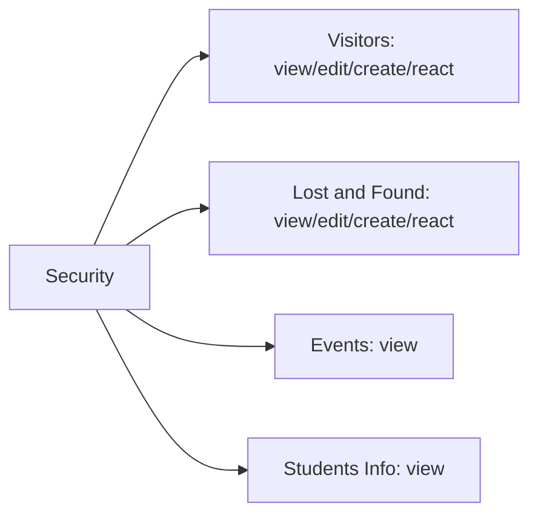
```mermaid
graph LR
  SEC[Security]
  SEC --> VIS["Visitors: view/edit/create/react"]
  SEC --> LAF["Lost and Found: view/edit/create/react"]
  SEC --> EV["Events: view"]
  SEC --> STINF["Students Info: view"]
```

Super Admin (defaults overview)

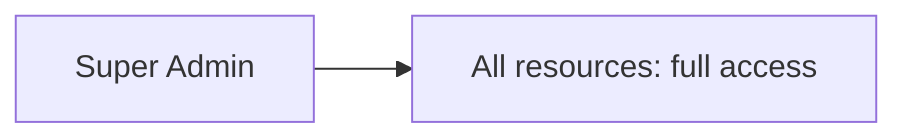
```mermaid
graph LR
  SA[Super Admin]
  SA --> ALL["All resources: full access"]
```

#### 3.4.2 Route-derived Role Access (Authorizations in routes/\*)

These diagrams reflect actual `authorizeRoles(...)` usage found in the route files and key `requirePermission(...)`-gated reads. They represent modules/endpoints currently accessible per role, independent of default permission maps.

Student (from `studentRoutes`, `complaintRoutes`, `eventRoutes`, `feedbackRoutes`, `lostAndFoundRoutes`, `uploadRoutes`, `paymentRoutes`, `undertakingRoutes`, `securityRoutes`)

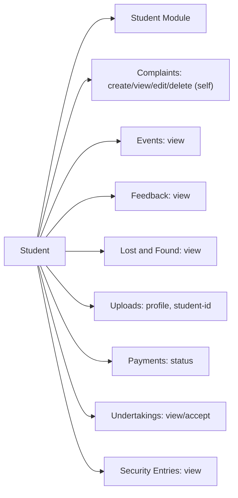
```mermaid
graph LR
  STU[Student]
  STU --> SMOD["Student Module"]
  STU --> CMP["Complaints: create/view/edit/delete (self)"]
  STU --> EV["Events: view"]
  STU --> FB["Feedback: view"]
  STU --> LAF["Lost and Found: view"]
  STU --> UP["Uploads: profile, student-id"]
  STU --> PAY["Payments: status"]
  STU --> UND["Undertakings: view/accept"]
  STU --> SEC["Security Entries: view"]
```

Warden (from `studentRoutes`, `hostelRoutes`, `complaintRoutes`, `disCoRoutes`, `familyMemberRoutes`, `eventRoutes`, `feedbackRoutes`, `lostAndFoundRoutes`, `inventoryRoutes`, `userRoutes`, `dashboardRoutes`, `uploadRoutes`, `securityRoutes`)

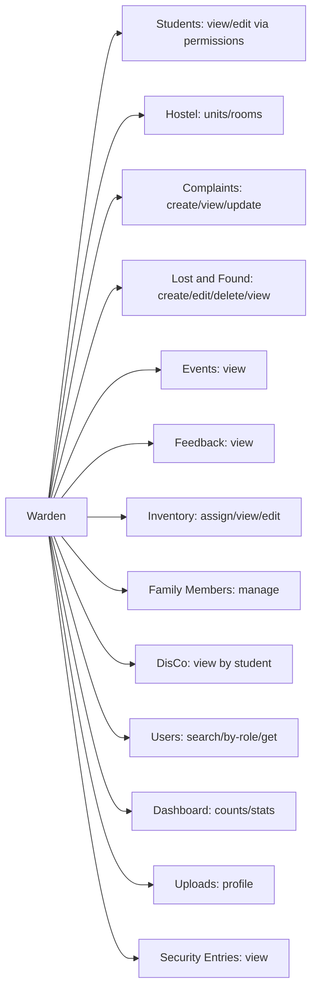
```mermaid
graph LR
  WAR[Warden]
  WAR --> STINF["Students: view/edit via permissions"]
  WAR --> HOST["Hostel: units/rooms"]
  WAR --> CMP["Complaints: create/view/update"]
  WAR --> LAF["Lost and Found: create/edit/delete/view"]
  WAR --> EV["Events: view"]
  WAR --> FB["Feedback: view"]
  WAR --> INV["Inventory: assign/view/edit"]
  WAR --> FAM["Family Members: manage"]
  WAR --> DSC["DisCo: view by student"]
  WAR --> USR["Users: search/by-role/get"]
  WAR --> DB["Dashboard: counts/stats"]
  WAR --> UP["Uploads: profile"]
  WAR --> SEC["Security Entries: view"]
```

Associate Warden & Hostel Supervisor (similar to Warden per routes)

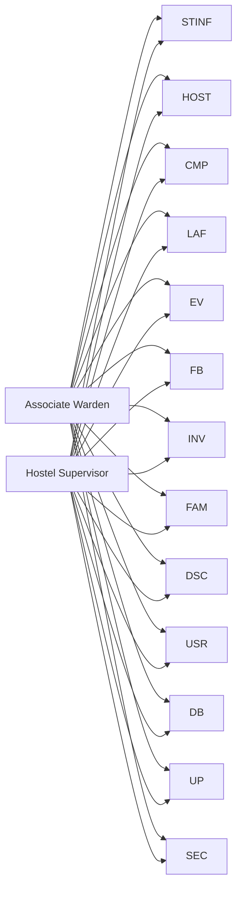
```mermaid
graph LR
  AW[Associate Warden] --> STINF
  AW --> HOST
  AW --> CMP
  AW --> LAF
  AW --> EV
  AW --> FB
  AW --> INV
  AW --> FAM
  AW --> DSC
  AW --> USR
  AW --> DB
  AW --> UP
  AW --> SEC

  HS[Hostel Supervisor] --> STINF
  HS --> HOST
  HS --> CMP
  HS --> LAF
  HS --> EV
  HS --> FB
  HS --> INV
  HS --> FAM
  HS --> DSC
  HS --> USR
  HS --> DB
  HS --> UP
  HS --> SEC
```

Admin (from virtually all modules; `adminRoutes`, `configRoutes`, `userRoutes`, `dashboardRoutes`, `taskRoutes`, `paymentRoutes`, etc.)

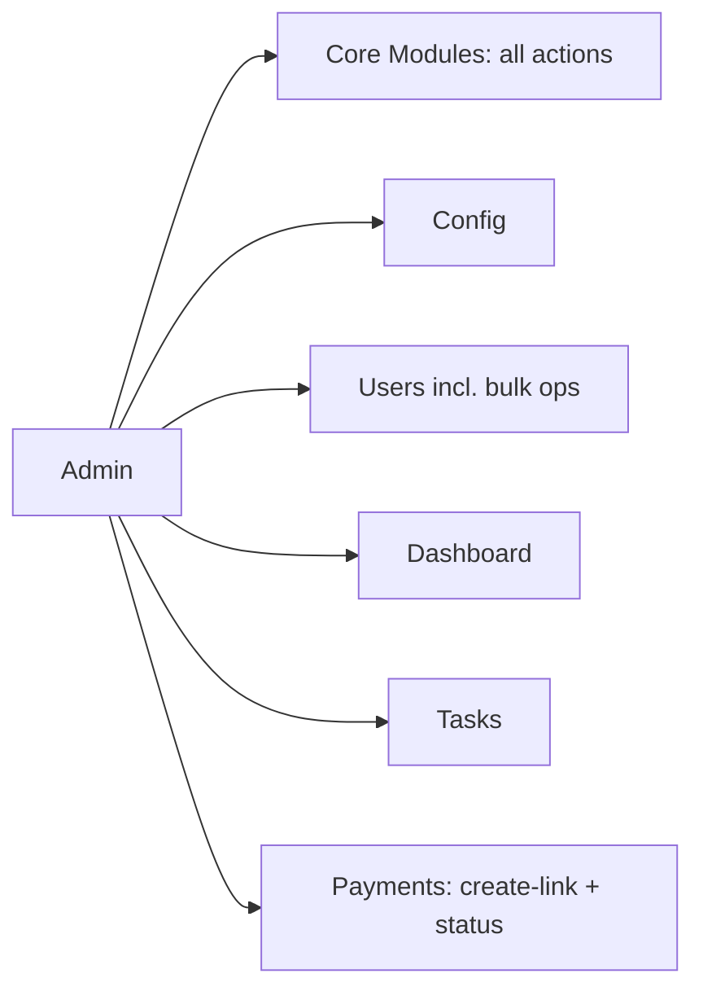
```mermaid
graph LR
  ADM[Admin]
  ADM --> ALL["Core Modules: all actions"]
  ADM --> CFG["Config"]
  ADM --> USR["Users incl. bulk ops"]
  ADM --> DB["Dashboard"]
  ADM --> TSK["Tasks"]
  ADM --> PAY["Payments: create-link + status"]
```

Super Admin

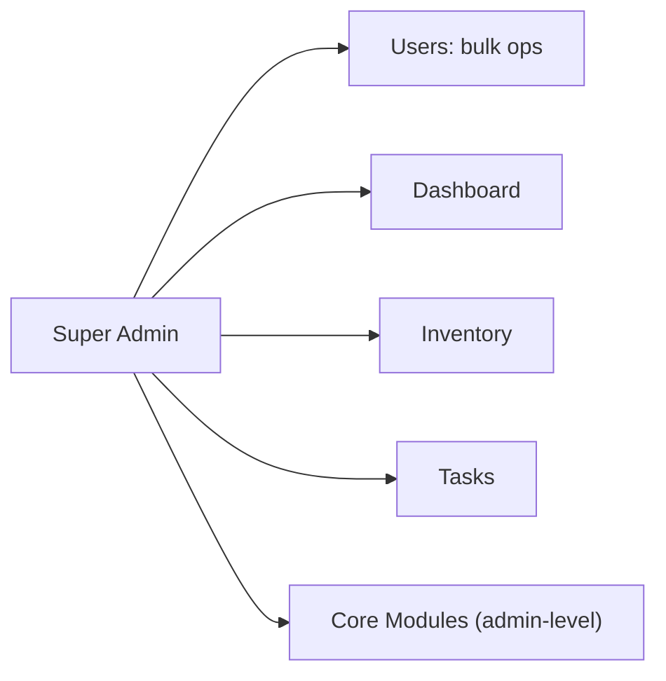
```mermaid
graph LR
  SA[Super Admin]
  SA --> USR["Users: bulk ops"]
  SA --> DB["Dashboard"]
  SA --> INV["Inventory"]
  SA --> TSK["Tasks"]
  SA --> CORE["Core Modules (admin-level)"]
```

Security & Hostel Gate (from `securityRoutes`, `lostAndFoundRoutes`)

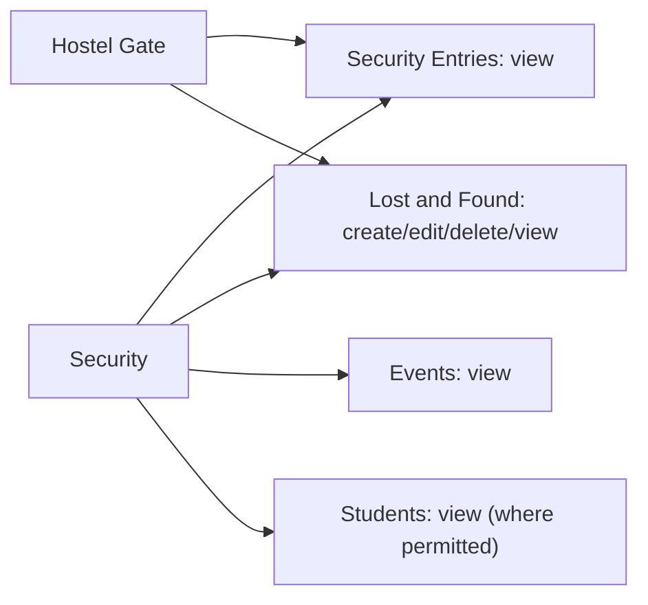
```mermaid
graph LR
  SEC[Security]
  SEC --> EN["Security Entries: view"]
  SEC --> LAF["Lost and Found: create/edit/delete/view"]
  SEC --> EV["Events: view"]
  SEC --> STINF["Students: view (where permitted)"]

  HG[Hostel Gate]
  HG --> EN["Security Entries: view"]
  HG --> LAF["Lost and Found: create/edit/delete/view"]
```

Maintenance Staff (from `complaintRoutes`)

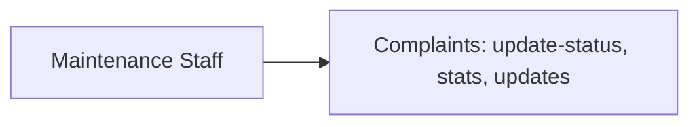
```mermaid
graph LR
  MSF[Maintenance Staff]
  MSF --> CMP["Complaints: update-status, stats, updates"]
```

### 3.5 Real-time Communication (Socket.io & Redis)

- Path: `/socket.io`
- Auth: Shared session middleware with Express.
- Implementation: `config/socket.js` and `utils/socketHandlers.js`.
- Redis: Used for pub/sub (adapter) and `addOnlineUser`/`removeOnlineUser` real-time state management.
- Rooms: Users automatically join rooms like `user:{userId}`, `role:{role}`, and `hostel:{hostelId}` for targeted broadcasts.

### 3.6 File Uploads and Storage (Local)

- Endpoints (authenticated):
  - `POST /api/upload/profile/:userId` (roles: Admin, Warden, Associate Warden, Hostel Supervisor, Student)
  - `POST /api/upload/student-id/:side` (role: Student)
  - `POST /api/certificate/add` (Administrative upload of certificates)
- `multer` in-memory, then either:
  - Local disk at `uploads/` (when `USE_LOCAL_STORAGE=true`) and served from `/uploads`
  - Local storage is served from `/uploads`

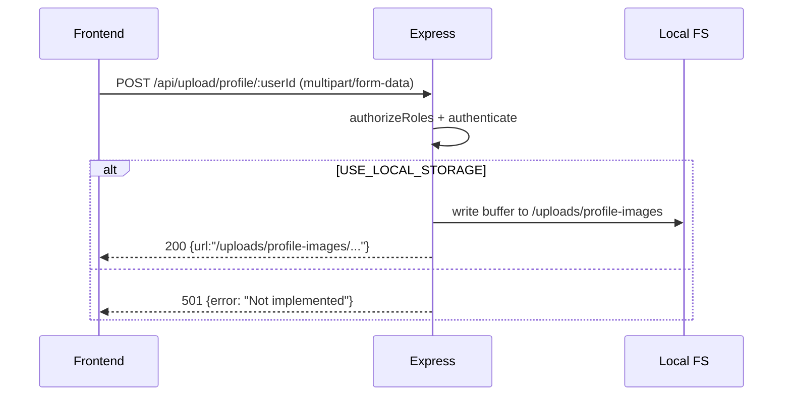
```mermaid
sequenceDiagram
  participant FE as Frontend
  participant EX as Express
  %% Azure Blob removed
  participant FS as Local FS

  FE->>EX: POST /api/upload/profile/:userId (multipart/form-data)
  EX->>EX: authorizeRoles + authenticate
  alt USE_LOCAL_STORAGE
    EX->>FS: write buffer to /uploads/profile-images
    EX-->>FE: 200 {url:"/uploads/profile-images/..."}
  else
    EX-->>FE: 501 {error: "Not implemented"}
  end
```

### 3.7 Payments (Razorpay)

- `POST /api/payment/create-link` (Admin) creates a payment link for an amount (INR); returns `short_url` and `id`
- `GET /api/payment/status/:paymentLinkId` (authorized roles + `requirePermission('visitors','view')`) fetches payment link status

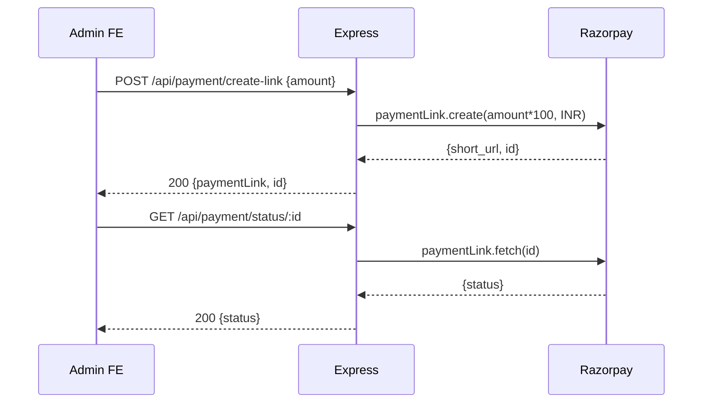
```mermaid
sequenceDiagram
  participant FE as Admin FE
  participant EX as Express
  participant RZ as Razorpay

  FE->>EX: POST /api/payment/create-link {amount}
  EX->>RZ: paymentLink.create(amount*100, INR)
  RZ-->>EX: {short_url, id}
  EX-->>FE: 200 {paymentLink, id}

  FE->>EX: GET /api/payment/status/:id
  EX->>RZ: paymentLink.fetch(id)
  RZ-->>EX: {status}
  EX-->>FE: 200 {status}
```

### 3.8 Face Scanner Integration

- Auth: Basic Auth via specialized `authenticateScanner` middleware.
- Actions: `GET /api/face-scanner/ping` for status checks, `POST /api/face-scanner/scan` for processing attendance.
- Processing: Logic handles recording entry/exit based on device configuration (direction "in" or "out").
- Configuration: Managed via dashboard for `username`, `password`, and `hostelId` linkage.

### 3.9 Configuration Management

- Configs stored in `models/configuration.js` with controller/utilities (`utils/configDefaults.js`) that auto-create defaults:
  - `degrees`, `departments`, `studentEditableFields`
- Utility `initializeDefaultConfigs()` ensures defaults are present

### 3.10 Logging and Error Handling

- Console logging for startup, DB connections, and errors in controllers
- Errors returned as JSON with appropriate HTTP status codes

### 3.11 Security Posture

- HTTPS recommended for all environments
- CORS: general routes use `ALLOWED_ORIGINS` with `credentials: true`. Specialized routes (SSO, Scanner) use permissive CORS with separate auth mechanisms.
- Sessions: `httpOnly`, `secure` in production, `sameSite: 'None'` in production; TTL 7 days; store crypto with `SESSION_SECRET`
- Passwords hashed via `bcrypt` with salt
- Sensitive configuration via environment variables

---

## 4. Functional Requirements

### 4.1 Auth & Session

- FR-A1: Users can log in via email/password
- FR-A2: Users can log in via Google ID token
- FR-A3: SSO support via signed JWT tokens for cross-domain usage
- FR-A4: Successful auth initializes a server-side session and sets secure cookie
- FR-A5: Authenticated users can fetch their profile (`/api/auth/user`) and refresh server-cached userData
- FR-A6: Users can update their password (when a password exists)
- FR-A7: Users can view and revoke device sessions
- FR-A8: Users can log out, destroying their session and clearing the cookie

### 4.2 Real-time Features

- FR-RT1: Real-time online user tracking stored in Redis
- FR-RT2: Role-based, hostel-based, and individual user message broadcasting
- FR-RT3: Heartbeat/activity tracking via Socket client events

### 4.3 Core Modules

Namespaces mounted under `/api/*` include: `auth`, `warden`, `student`, `admin`, `complaint`, `security`, `lost-and-found`, `event`, `hostel`, `stats`, `feedback`, `visitor`, `notification`, `disCo`, `payment`, `super-admin`, `family`, `staff`, `inventory`, `permissions`, `dashboard`, `tasks`, `users`, `config`, `student-profile`, `sso`, `undertaking`, `leave`, `certificate`, `face-scanner`, `sheet`, `online-users`.

Each module provides CRUD and actions consistent with the domain. Access is enforced via `authenticate`, `authorizeRoles`, and selectively `requirePermission`.

### 4.4 Supporting Modules

- Complaints: submission, assignment, status workflow
- Leave Management: application, approval/rejection cycle, and return (join) status
- Certificate Management: tracking and managing student documents
- Lost & Found: lost/found item lifecycle
- Events: creation and user reactions
- Visitors: digital logging of entry/exit
- Feedback: submission and reactions
- Notifications: role-targeted announcements
- Stats & Sheets: dashboard aggregates and spreadsheet-friendly data exports
- Inventory: tracking hostel and student items
- Tasks, Undertakings (digital signing), Staff Attendance, Family members, Dashboard, Config management

### 4.5 Payments

- FR-P1: Admin can generate payment link via Razorpay
- FR-P2: System can fetch payment link status

### 4.6 Uploads

- FR-U1: Authenticated users can upload profile images (role-restricted)
- FR-U2: Students can upload front/back of student ID cards
- FR-U3: System returns accessible URL from local storage

### 4.7 External API

- FR-E1: Provide integration endpoints under `/external-api`
- FR-E2: Enforce API-level authorization for clients (per `apiAuth` middleware)

---

## 5. Non-Functional Requirements

- Performance: typical GET APIs under 2s; login under 3s under normal load; socket latency < 500ms
- Availability: recommended 99.5%+ with proper infra
- Security: HTTPS-only, secure cookies, salted password hashes, CORS restrictions, principle of least privilege
- Reliability: database connection retries; session TTL cleanup via MongoDB TTL indexes; horizontal scaling of sockets with Redis
- Maintainability: modular routes/controllers/models; documentation in `/docs`

---

## 6. Interface Requirements

### 6.1 Software Interfaces (Environment Variables)

From `config/environment.js`:

- `NODE_ENV`, `PORT`
- `SESSION_SECRET`, `JWT_SECRET`
- `MONGO_URI`, `REDIS_URL`
- `RAZORPAY_KEY_ID`, `RAZORPAY_KEY_SECRET`
- `ALLOWED_ORIGINS` (comma-separated)
- `USE_LOCAL_STORAGE` ("true" to enable local file storage)

### 6.2 Communication Interfaces

- REST over HTTPS; JSON request/response bodies (multipart for uploads)
- WebSockets over WSS for real-time features
- CORS: configured per `server.js` matching environment variables

---

## 7. Data Model & Database Requirements

### 7.1 Data Entities Overview

Key entities include: `User`, `StudentProfile`, `Leave`, `Certificate`, `FaceScanner`, `Undertaking`, `UndertakingAssignment`, `Hostel`, `Unit`, `Room`, `RoomAllocation`, `Complaint`, `LostAndFound`, `Event`, `Notification`, `VisitorProfile`, `Visitors`, `Session`, `configuration`.

### 7.2 Key Schemas (Version 3.0 Additions)

- `Leave`: `userId`, `status` (Pending/Approved/Rejected), `startDate`, `endDate`, `approvalBy`, `joinStatus`.
- `Certificate`: `userId`, `certificateType`, `certificateUrl`, `issueDate`.
- `FaceScanner`: `username`, `passwordHash`, `direction` (in/out), `hostelId`, `isActive`.
- `Undertaking`: `title`, `content`, `deadline`, `createdBy`.

### 7.3 Indexing & Integrity

- Create indexes for frequent lookups (e.g., `User.email`, `Leave.userId`, `FaceScanner.username`).
- Maintain referential integrity for role-linked hostels and allocations.

### 7.4 ER Diagram (Detailed)

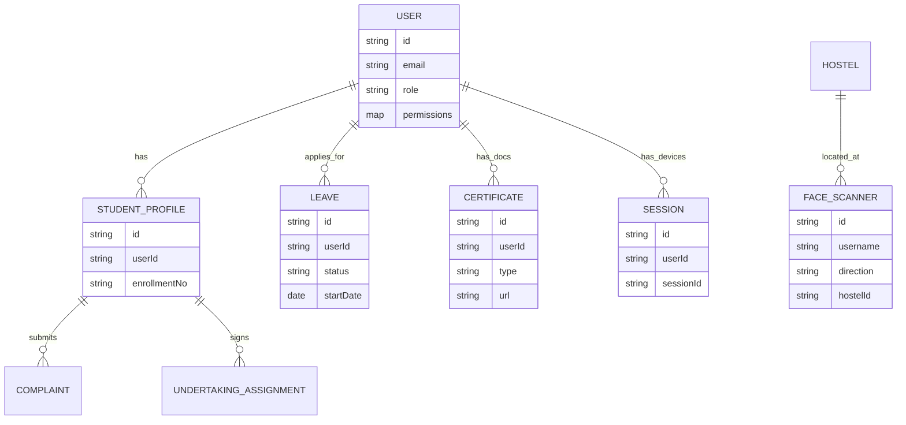
```mermaid
erDiagram
  USER {
    string id
    string email
    string role
    map permissions
  }

  STUDENT_PROFILE {
    string id
    string userId
    string enrollmentNo
  }

  LEAVE {
    string id
    string userId
    string status
    date startDate
  }

  CERTIFICATE {
    string id
    string userId
    string type
    string url
  }

  FACE_SCANNER {
    string id
    string username
    string direction
    string hostelId
  }

  SESSION {
    string id
    string userId
    string sessionId
  }

  USER ||--o{ STUDENT_PROFILE : has
  USER ||--o{ LEAVE : applies_for
  USER ||--o{ CERTIFICATE : has_docs
  USER ||--o{ SESSION : has_devices
  HOSTEL ||--o{ FACE_SCANNER : located_at
  STUDENT_PROFILE ||--o{ COMPLAINT : submits
  STUDENT_PROFILE ||--o{ UNDERTAKING_ASSIGNMENT : signs
```

---

## 8. API Surface Overview

### 8.1 Route Namespaces (mounted in `server.js`)

- `/api/auth`
- `/api/leave`
- `/api/certificate`
- `/api/face-scanner`
- `/api/undertaking`
- `/api/online-users`
- `/api/sheet`
- `/api/sso`
- `/api/student-profile`
- `/api/warden`
- `/api/student`
- `/api/admin`
- `/api/complaint`
- `/api/security`
- `/api/lost-and-found`
- `/api/event`
- `/api/hostel`
- `/api/stats`
- `/api/feedback`
- `/api/visitor`
- `/api/notification`
- `/api/disCo`
- `/api/payment`
- `/api/super-admin`
- `/api/family`
- `/api/staff`
- `/api/inventory`
- `/api/permissions`
- `/api/dashboard`
- `/api/tasks`
- `/api/users`
- `/api/config`
- `/api/upload`
- `/external-api`

### 8.2 High-Level Route Map

```mermaid
graph TD
  A[/server.js/] -->|mount| AU[/api/auth/]
  A --> LE[/api/leave/]
  A --> CE[/api/certificate/]
  A --> FS[/api/face-scanner/]
  A --> UN[/api/undertaking/]
  A --> OU[/api/online-users/]
  A --> SH[/api/sheet/]
  A --> SSO[/api/sso/]
  A --> WA[/api/warden/]
  A --> ST[/api/student/]
  A --> AD[/api/admin/]
  A --> CP[/api/complaint/]
  A --> SC[/api/security/]
  A --> LF[/api/lost-and-found/]
  A --> EV[/api/event/]
  A --> HO[/api/hostel/]
  A --> PM[/api/payment/]
  A --> UP[/api/upload/]
  A --> EXT[/external-api/]
```

---

## 9. Appendices

### 9.1 Security Checklist

- Enforce HTTPS end-to-end.
- Set `ALLOWED_ORIGINS` precisely.
- Ensure `secure` cookies in production; `sameSite: 'None'`.
- Validate and sanitize inputs for all endpoints.
- Store credentials only in environment variables.

### 9.2 Operations Notes

- Session and online-user stores use MongoDB/Redis with TTL for automated cleanup.
- Face Scanners require unique Basic Auth credentials configured in the system.

### 9.3 Future Enhancements

- Rate limiting and structured logging.
- Enhanced support for facial recognition metadata.

---

This SRS reflects the comprehensive version 3.0 backend implementation.
