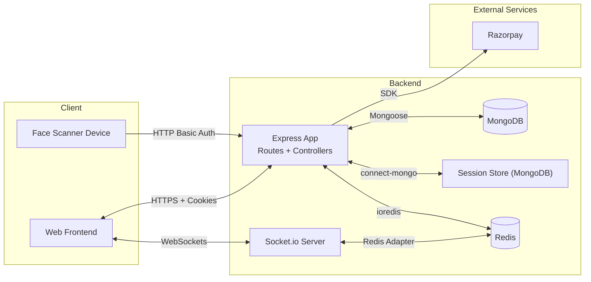
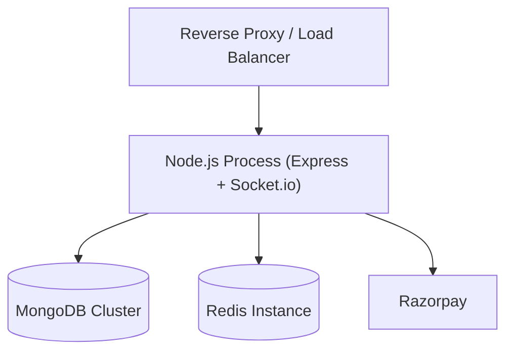
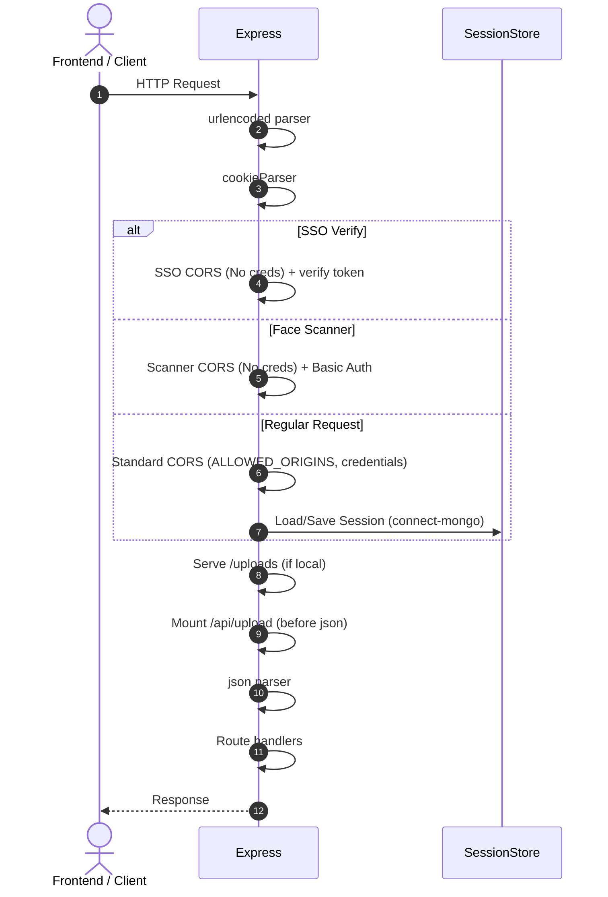
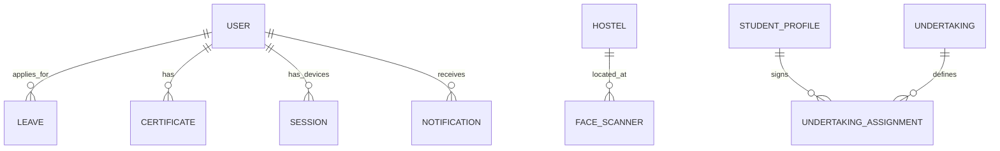

## Software Requirements Specification (SRS)

### Hostel Management System (HMS) – Backend API

Version: 3.0  
Date: 2026-01-08

### Revision History

- 1.0 (2024-08-02): Initial SRS
- 2.0 (2025-08-10): Fully revised to match implemented backend: session-based auth, RBAC/permissions, Razorpay payments, external API, deployment and detailed diagrams
- 3.0 (2026-01-08): Updated with Socket.io (real-time), Redis adapter, Face Scanner (automated attendance), Leave Management, Certificates, Undertakings, and Spreadsheet-view data APIs.

## Table of Contents

1. Introduction
   - 1.1 Purpose
   - 1.2 Scope
   - 1.3 Definitions, Acronyms, Abbreviations
   - 1.4 References
   - 1.5 Overview
2. Overall Description
   - 2.1 Product Perspective
   - 2.2 Architectural Overview (with diagrams)
   - 2.3 Product Functions
   - 2.4 User Characteristics
   - 2.5 Constraints
   - 2.6 Assumptions and Dependencies
3. Detailed Architecture
   - 3.1 Runtime and Deployment Architecture
   - 3.2 Request Lifecycle and Middleware Order
   - 3.3 Authentication and Session Management (incl. SSO)
   - 3.4 Authorization and RBAC Permissions Model
   - 3.5 Real-time Communication (Socket.io & Redis)
   - 3.6 File Uploads and Storage (Local)
   - 3.7 Payments (Razorpay)
   - 3.8 Face Scanner Integration
   - 3.9 Configuration Management
   - 3.10 Logging and Error Handling
   - 3.11 Security Posture
4. Functional Requirements
   - 4.1 Auth & Session
   - 4.2 Real-time Features
   - 4.3 Core Modules (Student, Warden, Admin, Security, Super Admin)
   - 4.4 Supporting Modules (Complaints, Lost & Found, Events, Visitors, Feedback, Notifications, Stats, Inventory, Tasks, Undertakings, Leave, Certificates, Face Scanner)
   - 4.5 Payments
   - 4.6 Uploads
   - 4.7 External API
5. Non-Functional Requirements
6. Interface Requirements
   - 6.1 Software Interfaces
   - 6.2 Communication Interfaces
7. Data Model & Database Requirements
   - 7.1 Data Entities Overview
   - 7.2 Key Schemas
   - 7.3 Indexing & Integrity
   - 7.4 ER Diagram
8. API Surface Overview
   - 8.1 Route Namespaces
   - 8.2 High-Level Route Map (diagram)
9. Appendices

---

## 1. Introduction

### 1.1 Purpose

This SRS defines the backend API for the Hostel Management System (HMS). It captures implemented behavior and design so engineering, QA, security, and stakeholders share a single, accurate reference.

### 1.2 Scope

Backend API built with Node.js and Express, using MongoDB via Mongoose. It supports:

- Authentication (email/password, Google) and server-side sessions
- Single Sign-On (SSO) integration via JWT tokens
- Real-time communication via Socket.io with Redis adapter
- Role-based access and fine-grained permissions
- Automated attendance tracking via Face Scanners
- Student, Warden, Admin, Security, Super Admin modules
- Complaints, Lost & Found, Events, Visitors, Feedback, Notifications, Stats, Leave, Certificates
- Hostel/Rooms (with spreadsheet-view API), Inventory, Tasks, Undertakings
- File uploads to local filesystem
- Razorpay payment link creation and status checks
- External API namespace for integrations

### 1.3 Definitions, Acronyms, Abbreviations

- HMS: Hostel Management System
- RBAC: Role-Based Access Control
- CORS: Cross-Origin Resource Sharing
- TTL: Time To Live (expiry)
- SSO: Single Sign-On

### 1.4 References

- Codebase: `server.js`, `routes/*`, `controllers/*`, `models/*`, `middlewares/*`, `externalApi/*`, `config/socket.js`, `utils/socketHandlers.js`
- Express, Mongoose, connect-mongo, express-session, Socket.io, Redis
- Razorpay Node SDK

### 1.5 Overview

The document explains architecture and behavior first, then enumerates requirements, interfaces, and data models with diagrams.

---

## 2. Overall Description

### 2.1 Product Perspective

The API is the central service in a client–server architecture. A separate frontend consumes REST endpoints over HTTPS and maintains real-time connections via WebSockets. Data persists in MongoDB; sessions are stored in MongoDB via `connect-mongo`. Redis is used for Socket.io distribution and real-time online user tracking.

### 2.2 Architectural Overview (with diagrams)

#### Deployment View

#### Request Lifecycle & Middleware Order

As implemented in `server.js`:

1. express.urlencoded → cookieParser → Session-specific CORS (if SSO/Scanner) → Regular CORS (with credentials) → express-session (connect-mongo) → static `/uploads` (if local) → mount `/api/upload` → express.json → mount remaining routes

### 2.3 Product Functions

- Server-side session login (email/password, Google)
- RBAC by role plus permission map
- Real-time updates via Socket.io (online status, notifications)
- Automated Face Scanner processing for gate attendance
- CRUD around students, rooms, hostels, visitors, lost & found, complaints, events, leave, certificates, undertakings
- File upload for profile images, student ID cards, and certificates
- Razorpay payment link creation and status fetch
- External API namespace for integrations

### 2.4 User Characteristics

- Students: Basic web skills
- Wardens/Admin/Security: Basic web skills
- Super Admin: Intermediate (system configuration)
- Face Scanner: Embedded device client

### 2.5 Constraints

- Node.js runtime, Express framework, Socket.io
- MongoDB database (Disk)
- Redis database (Memory - for real-time state)
- Razorpay account/keys for payments

### 2.6 Assumptions and Dependencies

- Valid user accounts exist
- External services (Razorpay, Redis) are reachable
- Frontend is hosted with allowed origins configured

---

## 3. Detailed Architecture

### 3.1 Runtime and Deployment Architecture

- Single Express application mounting routers under `/api/*`, `/external-api`.
- Session management using `express-session` with `connect-mongo` store.
- Real-time layer using `Socket.io` with `redis-adapter` for scaling across multiple instances.

### 3.2 Request Lifecycle and Middleware Order

See sequence above. The upload routes are mounted before `express.json()` to support multipart handling. Specialized CORS handlers exist for SSO and Face Scanner routes to bypass credential requirements where necessary.

### 3.3 Authentication and Session Management

- Email/password login: `POST /api/auth/login`
- Google login: `POST /api/auth/google`
- SSO: `GET /api/sso/redirect` (signs JWT) and `POST /api/sso/verify` (verifies JWT)
- Logout: `GET /api/auth/logout`

Session details:
- Stored in MongoDB. Includes `userId`, `role`, `userData` (permissions, hostel info).
- `Session` collection tracks active device sessions for remote logout.

### 3.4 Authorization and RBAC Permissions Model

- Roles: `Student`, `Maintenance Staff`, `Warden`, `Associate Warden`, `Admin`, `Security`, `Super Admin`, `Hostel Supervisor`, `Hostel Gate`.
- Permissions: Fine-grained Map of `resource` -> `{view, edit, create, delete, react}`.

### 3.5 Real-time Communication (Socket.io & Redis)

- Path: `/socket.io`
- Auth: Shared session middleware with Express.
- Implementation: `config/socket.js` and `utils/socketHandlers.js`.
- Redis: Used for pub/sub (adapter) and `addOnlineUser`/`removeOnlineUser` state management.
- Rooms: Users automatically join rooms like `user:{userId}`, `role:{role}`, and `hostel:{hostelId}`.

### 3.6 Face Scanner Integration

- Auth: Basic Auth via `authenticateScanner` middleware.
- Actions: `GET /api/face-scanner/ping`, `POST /api/face-scanner/scan`.
- Processing: Logic in `scannerActionController.js` and `faceScannerController.js`.
- Directions: "in" or "out" per scanner configuration.

### 3.7 File Uploads and Storage (Local)

- Endpoints: `/api/upload/profile/:userId`, `/api/upload/student-id/:side`, `/api/certificate/add`.
- Storage: Local disk at `uploads/`. Serving from `/uploads`.

### 3.8 Payments (Razorpay)

- `POST /api/payment/create-link` (Admin).
- `GET /api/payment/status/:paymentLinkId`.

### 3.9 Configuration Management

- `models/configuration.js` stores application-wide settings (degrees, departments, etc.).
- Initialized via `utils/configDefaults.js`.

---

## 4. Functional Requirements

### 4.1 Auth & Session

- FR-A1: Users can log in via email/password or Google
- FR-A2: SSO support via signed JWT tokens
- FR-A3: Device session management and remote logout

### 4.2 Real-time Features

- FR-RT1: Real-time online user tracking (stored in Redis)
- FR-RT2: Role-based and user-based message broadcasting
- FR-RT3: Heartbeat activity tracking via Socket events

### 4.3 Core Modules

CRUD and domain logic for:
- Student Profiles: Management of academic and personal info
- Hostel Management: Hosting, Rooms, Units, Allocations (incl. Spreadsheet view)
- Leave Management: Student leave application, Warden/Admin approval/rejection, Join status reporting
- Certificate Management: Uploading and managing student certificates
- Undertakings: Creating and assigning digitized undertakings for student acceptance

### 4.4 Face Scanner

- FR-FS1: Scanners register and authenticate via Basic Auth
- FR-FS2: Process scan data to record gate entry/exit automatically

### 4.5 Supporting Modules

- Complaints, Lost & Found, Events, Visitors, Feedback, Notifications, Stats.
- Inventory: Tracking hostel-issued items (Hostel Inventory) and student personal items (Student Inventory).
- Staff Attendance: Tracking maintenance staff attendance.

---

## 5. Non-Functional Requirements

- Performance: API response < 2s; Real-time latency < 500ms.
- Scalability: Redis adapter allows horizontal scaling of Socket.io nodes.
- Security: HTTPS required; Passwords hashed; Permission-based gating.

---

## 6. Interface Requirements

### 6.1 Software Interfaces (Environment Variables)

- `MONGO_URI`, `REDIS_URL`, `SESSION_SECRET`, `JWT_SECRET`, `RAZORPAY_KEY_*`, `ALLOWED_ORIGINS`, `USE_LOCAL_STORAGE`.

---

## 7. Data Model & Database Requirements

### 7.1 Data Entities Overview

Key Added Entities: `Leave`, `Certificate`, `FaceScanner`, `Undertaking`, `UndertakingAssignment`, `Session`.

### 7.2 Key Schemas (Version 3.0 Additions)

- `Leave`: `userId`, `status` (Pending/Approved/Rejected), `startDate`, `endDate`, `approvalBy`, `joinStatus`.
- `FaceScanner`: `username`, `passwordHash`, `direction` (in/out), `hostelId`, `isActive`.
- `Certificate`: `userId`, `certificateType`, `certificateUrl`, `issueDate`.

### 7.4 ER Diagram

---

## 8. API Surface Overview

### 8.1 Route Namespaces

- `/api/auth`
- `/api/leave`
- `/api/certificate`
- `/api/face-scanner`
- `/api/undertaking`
- `/api/online-users`
- `/api/live-checkinout`
- `/api/sheet` (Hostel Spreadsheet data)
- `/api/sso`
- `/api/student-profile`
- ... (and 2.0 namespaces like `/api/warden`, `/api/admin`, `/api/complaint`, etc.)

---
