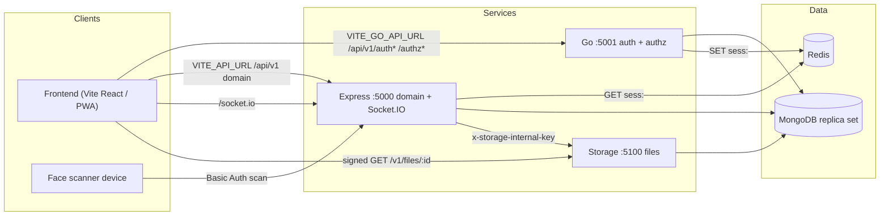
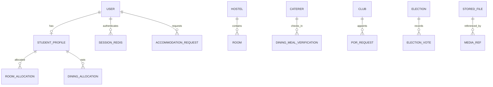

## Software Requirements Specification (SRS)

### Hostel Management System (HMS) — Complete Product

Version: 5.0  
Date: 2026-09-21

### Revision History

- 1.0–3.0: Express-only SRS (session auth, Razorpay, Socket.IO, scanners)
- 4.0–4.3 (2026-09-21): Express rewritten to the current modular monolith
- 5.0 (2026-09-21): Single product SRS covering all four services: frontend, Go backend, Express backend, storage backend

### Table of Contents

1. Introduction
2. Overall Description
3. Architecture (Frontend, Go, Storage, Express)
4. Functional Requirements
5. Non-Functional Requirements
6. Interface Requirements
7. Data Model
8. API Surface
9. Appendices

---

## 1. Introduction

### 1.1 Purpose

This is the **product SRS** for HMS (Hostel Management System / SMS) at IIT Indore. It describes implemented behavior of the four live services so a receiving team can operate and extend the system from one document.

Per-service coding conventions stay in each service’s `STRUCTURE_GUIDE.md`. This file states **what the product does**.

### 1.2 Scope

Four services, one product:

| Service | Default port | Stack | Owns |
|---|---|---|---|
| **Frontend** | Vite 5173 | React 19, Vite, TanStack Query, hzero, Capacitor | Role portals, public token pages, PWA |
| **Go backend** | 5001 | Go 1.23, `net/http`, mongo-driver, go-redis | Login, sessions, SSO, Google, password reset, AuthZ catalog HTTP |
| **Express backend** | 5000 | Node ESM, Express 5, Mongoose 9, Socket.IO | Domain REST, scanners, jobs, realtime |
| **Storage backend** | 5100 | Rust, Axum, Mongo | File bytes, policies, signed download URLs |

Shared infrastructure: **MongoDB replica set**, **Redis**.

In scope: every live user and device flow listed in §4.  
Out of scope: payment-gateway capture; empty student-affairs folders (scholarship, counseling, SA disciplinary); a live Grievance model.

### 1.3 Definitions

| Term | Meaning |
|---|---|
| HMS | Hostel Management System (also SMS in some files) |
| AuthZ | Catalog of route keys, capabilities, constraints, plus per-user overrides |
| Session bridge | Redis document Go writes and Express reads (`connect.sid`) |
| `media://` | Opaque file ref in Mongo; resolved to a short-lived signed URL |
| Effective AuthZ | Catalog + role/sub-role defaults + override, computed in memory |
| Owner / Queries | Express-only: the only files allowed to touch a Mongoose model |
| POR | Position of Responsibility |
| DisCo | Disciplinary Committee |
| CWO | Chief Warden Office (Admin sub-role) |
| HCU | Halls of Residence / hostel-ops Admin sub-role |
| SSO | External HMS SSO, verified by Go |

### 1.4 References (inside the four services)

- Frontend: `src/routes/AppRoutes.jsx`, `src/config/apiConfig.js`, `src/service/core/apiClient.js`, `src/components/authz/RouteAccessGuard.jsx`, `docs/data-fetching.md`, `structure_design.md`
- Go: `cmd/api`, `internal/modules/auth`, `internal/modules/authz`, `internal/modules/simauth`, `internal/shared/session`, `STRUCTURE_GUIDE.md`, `MIGRATION_NOTES.md`
- Express: `src/server.js`, `src/loaders/express.loader.js`, `src/apps/*`, `src/core/authz/`, `STRUCTURE_GUIDE.md`, `docs/accommodation-flow.md`, `tests/AGENTS.md`
- Storage: `src/app.rs`, `src/policy.rs`, `src/storage.rs`, `STRUCTURE_GUIDE.md`

### 1.5 Overview

Section 2 is the product. Section 3 is each service. Section 4 is functional requirements (UI, auth, domain, files). Later sections cover env, data, HTTP, and handover risks.

---

## 2. Overall Description

### 2.1 Product Perspective

Students, wardens, admins, gymkhana, dining, security, and other staff use HMS for rooms, complaints, visitors, dining, events, elections, leave, inventory, and related workflows.


```mermaid
graph LR
  subgraph Clients
    FE["Frontend (Vite React / PWA)"]
    SC["Face scanner device"]
  end
  subgraph Services
    GO["Go :5001 auth + authz"]
    EX["Express :5000 domain + Socket.IO"]
    ST["Storage :5100 files"]
  end
  subgraph Data
    MS[(MongoDB replica set)]
    RD[(Redis)]
  end
  FE -->|VITE_GO_API_URL /api/v1/auth* /authz*| GO
  FE -->|VITE_API_URL /api/v1 domain| EX
  FE -->|/socket.io| EX
  FE -->|signed GET /v1/files/:id| ST
  SC -->|Basic Auth scan| EX
  GO --> MS
  GO -->|SET sess:| RD
  EX -->|GET sess:| RD
  EX --> MS
  EX -->|x-storage-internal-key| ST
  ST --> MS
```

### 2.2 Product Functions

- Authenticate (email, Google, SSO) and keep a shared cookie session
- Role portals with route-key AuthZ (nav filter + route guard)
- Hostel, student, dining, complaints, visitors, accommodation, leave, inventory, campus life, gymkhana/SA workflows
- Real-time invalidation and live gate/mess feeds
- Files via storage policies and `media://` refs
- Public token pages (complaint feedback, election ballot/support, H2 faculty advisor)

### 2.3 User Characteristics

Roles: Student, Admin, Super Admin, Warden, Associate Warden, Hostel Supervisor, Security, Hostel Gate, Maintenance Staff, Gymkhana, Academics, Dining.

Dining sub-roles: `Office`, `Caterer`. Office categories: `Dining Warden`, `Dining Hall Supervisor`.  
Admin sub-roles: HCU, Student Affairs, Officer SA, Associate Dean SA, Dean SA, Chief Warden, Chief Warden Office, Accountant.  
Gymkhana sub-roles: GS Gymkhana, President Gymkhana, Election Officer, Councils, Committee, Mega Events, Club.  
Academics sub-role: HOD.

Machine clients: face scanners (`hostel-gate` or `dining-meal`). Super-Admin can CRUD `ApiClient` records; no live request middleware consumes those keys.

### 2.4 Constraints and dependencies

- Mongo replica set (Express transactions)
- Redis required (sessions, Socket.IO adapter, locks, caches, device index)
- Session secret, prefix, cookie name, TTL, SameSite/Secure **identical** on Go and Express
- Storage `INTERNAL_API_KEY` must match Express `STORAGE_INTERNAL_API_KEY`
- AuthZ catalog is compiled **twice** (Go + Express) — versions must stay aligned (§9.5)
- Users are provisioned in Admin flows; Google/SSO do not auto-create accounts

---

## 3. Architecture

### 3.1 Frontend

Vite + React 19. Default API bases:

- `VITE_API_URL` → Express `http://localhost:5000/api/v1`
- `VITE_GO_API_URL` → Go `http://localhost:5001/api/v1`

`src/service/core/apiClient.js` + `goApiClient` send cookies (`credentials`). Auth and AuthZ modules use Go; domain modules use Express.

App shell (`src/App.jsx`): QueryClient → BrowserRouter → AuthProvider → SocketProvider → QueryInvalidationBridge → AuthzProvider → routes.

AuthZ UI pattern:

1. `RouteAccessGuard` on each private route (`canRoute(routeKey)`)
2. `useAuthorizedNavItems` filters layout nav
3. `can` / `canAny` from `useAuthz` only for planned capability checks (`cap.students.edit.personal`)

Data: TanStack Query; keys from `src/lib/query/queryKeys.js`; sockets `visitor-update`, `complaint-update`, `notification` invalidate caches. Some live pages also listen for `gateentry:new` and dining meal events.

Public routes (no session): `/`, `/login`, `/sso`, `/forgot-password`, `/reset-password`, `/complaint-feedback/:token`, `/election-support-confirmation/:token`, `/election-ballot/:token`, accommodation recommendation token page.

Role route trees (lazy): Super Admin, Student, Maintenance, Warden, Associate Warden, Hostel Supervisor, Security, Hostel Gate, Admin, Gymkhana, Academics, Caterer, Dining Office.

UI kit: **hzero** + design tokens (`docs/design.md`, `docs/ui.md`). Capacitor Android wrapper exists. PWA install/update prompts.

### 3.2 Go backend (auth + AuthZ)

Modular monolith: handler → service → repository.

```
cmd/api
internal/app                 mux, CORS, recover, shutdown
internal/config
internal/platform/mongo|redis
internal/shared/httpx|session|email
internal/modules/auth|authz|simauth
```

Start: `make run` / `go run ./cmd/api`. Build: `make build` → `bin/hms-auth`. Tests: `go test ./...`.

**Session contract (must match Express)**

- Cookie `connect.sid`, value `s:<id>.<hmac-sha256>`
- Redis key `{REDIS_SESSION_PREFIX}{id}` default `sess:`
- JSON: `userId`, `role`, `email`, `userData` (`_id`, `email`, `role`, `subRole`, `authz.override` only, `hostel`, `pinnedTabs`, `sidebarMode`, `theme`)
- **Never persist `authz.effective` in Redis**
- Device index: `session:meta:v1`, `session:user:v1`
- Touch refreshes TTL (default 7 days)
- SameSite: Lax on HTTP, None+Secure on HTTPS (`SESSION_SECURE`)

**Login paths:** email/password (bcrypt); Google `id_token` via tokeninfo; SSO POST to `AUTH_SSO_VERIFY_URL`. Existing user only. AES key minted on first login (returned to client). Hostel summary from wardens / associatewardens / hostelsupervisors / hostelgates / securities.

**AuthZ HTTP:** in-process catalog. `GET /authz/catalog`, `GET /authz/me`. Super Admin + `route.superAdmin.authz`: list users, get/update/reset override (`reason` required), write `authzaudits`.

Go catalog version **15**. Express catalog version **18**. Media route keys exist in Express only (§9.5).

**Sim (flagged):** `POST /api/v1/sim/auth/google` with `X-Sim-Key` issues `sim.sid` / `sim:sess:`. AES keys go to `sim_user_aes`, not `users`.

Envelope: `{ success, message, data, errors }`.

### 3.3 Storage backend

Rust Axum. Default port **5100**. Files on disk under `DATA_ROOT`; metadata in Mongo DB `MONGO_DB_NAME` (default `hms_storage`).

Internal routes require header `x-storage-internal-key` = `INTERNAL_API_KEY`. Browsers never call internal routes.

| Method | Path | Who |
|---|---|---|
| GET | `/health` | anyone |
| POST | `/internal/v1/files` | Express upload (multipart + policy) |
| POST | `/internal/v1/files/sign` | Express media resolve |
| GET | `/internal/v1/files/:file_id/meta` | Express |
| GET | `/internal/v1/files/:file_id/content` | Express |
| DELETE | `/internal/v1/files/:file_id` | Express |
| GET | `/v1/files/:file_id?expires&signature&disposition` | Browser, HMAC signed |

Body limit 20 MB. Policies in `policy.rs` (see §3.4 uploads). Soft-delete via `deleted_at`. `file_ref` is `media://…`.

### 3.4 Express backend (domain)

Modular monolith. `src/loaders/express.loader.js` is the mount-point source of truth. Model access only in `src/services/<domain>/*Owner` and `*Queries` (`npm run check:boundary`).

| App | Mount | Owns |
|---|---|---|
| `iam` | `/api/v1` | `/users/*`, `/signature/*` |
| `complaints` | `/api/v1` | `/complaint/*` |
| `visitors` | `/api/v1` | `/visitor/*`, `/accommodation/*`, `/appointments/*`, `/jr-appointments/*` |
| `operations` | `/api/v1` | tasks, live-checkinout, inventory, staff, hostel, leave, sheet, online-users, security, face-scanner, dining-meal-verification, dining-office, dashboard, stats |
| `campus-life` | `/api/v1` | event, lost-and-found, feedback, notification, undertaking, disCo, certificate |
| `administration` | `/api/v1` | admin, warden, super-admin, family, config, email, media, upload |
| `students` | `/api/v1/students` | profile, profiles-admin, profiles-self, dining |
| `student-affairs` | `/api/v1/student-affairs` | grievances (stub), events, overall-best-performer, elections, clubs, por, attendance, expenditure |
| `sim` | `/api/v1/sim` | dining load-sim (flagged) |

No auth app. Login is Go.

**Pipeline:** urlencoded 1 MB → cookieParser → scanner CORS on legacy `/api/face-scanner/{ping,scan,test-auth}` → CORS credentials → Redis session (skipped for `/api/v1/sim`) → optional `/uploads` → JSON 1 MB → routers → `/health` → 404 → errorHandler. `trust proxy` = 1.

Protected order: `authenticate` (hydrate `req.user`, effective AuthZ **in memory**) → `authorizeRoles` → `requireRouteAccess` / `routeGuard`. Public routes are declared before `authenticate`.

**Uploads:** multer memory → storage `POST /internal/v1/files` with a policy → Mongo stores `media://`. `GET/POST /api/v1/media/resolve` returns a signed URL. Fallbacks: `USE_LOCAL_STORAGE=true` serves `/uploads`; Azure env vars remain for legacy.

| Policy key | Max | Allowed |
|---|---|---|
| `profile-image` | 500 KB | images |
| `student-id-card` | 1 MB | images |
| `signature-image` | 256 KB | images |
| `payment-screenshot`, `lost-and-found-image` | 5 MB | images |
| event/h2/disco/election/por/obp/insurance PDFs | 10 MB | PDF |
| `certificate` | 10 MB | images + PDF |

**Face scanners** at `/api/v1/face-scanner`: device Basic Auth or legacy header; types `hostel-gate` (hostelId, in/out) and `dining-meal` (catererId). Logs: `logs/scanner_requests.log`, `logs/student_not_found.log`.

**Jobs:** hourly Redis-locked — accommodation 24h Chief Warden auto-approve; daily stay-end invoices. Also: events/L&F first-page cache; election voting-email dispatch.

**Action-link tokens:** hashed one-time email links for complaint feedback, H2 faculty advisor, election supporter/ballot.

**Sockets:** `/socket.io`, session auth, Redis adapter. Rooms `user:`, `role:`, `hostel:`, `caterer:`. Broadcasts `notification`, `visitor-update`, `complaint-update`; presence `user:online`/`offline`; client `activity`.

**Payments:** no Razorpay. Accommodation screenshot + 12-digit UTR; visitor payment-info amount; SA expenditure bookkeeping.

**Config keys:** degrees, departments, studentBatches, studentGroups, studentEditableFields, systemSettings, accommodation (CWO+Accountant only), academicHolidays, gymkhanaEventCategories, porCertificateTemplate.

Express catalog version **18**. Runtime AuthZ is always strict 403.

---

## 4. Functional Requirements

### 4.1 Frontend

- FR-FE1: Public home, login, SSO, forgot/reset password
- FR-FE2: After login, open the portal for the user’s role; hide nav items the catalog does not allow
- FR-FE3: Guard private pages with `RouteAccessGuard`
- FR-FE4: Public token pages for complaint feedback, election support, election ballot, H2 faculty recommendation
- FR-FE5: Auth/AuthZ HTTP via Go client; domain HTTP via Express client; cookies included
- FR-FE6: TanStack Query caching; socket invalidation for visitors, complaints, notifications
- FR-FE7: Live pages for gate entries and caterer meal verification
- FR-FE8: Super-Admin AuthZ UI reads **Go** catalog/overrides
- FR-FE9: PWA install/update; optional Capacitor Android build
- FR-FE10: Design tokens + hzero only (no ad-hoc color literals in new UI)

### 4.2 Authentication and AuthZ (Go)

- FR-A1: Email/password login; set `connect.sid`
- FR-A2: Google ID-token login for an existing user
- FR-A3: External SSO token login for an existing user
- FR-A4: `GET /auth/user` with effective AuthZ and hostel summary
- FR-A5: Refresh session from Mongo
- FR-A6: Logout (delete Redis + clear cookie)
- FR-A7: List devices; logout another device
- FR-A8: Change password (old + new)
- FR-A9: Forgot / verify / reset password email (`FRONTEND_URL/reset-password?token=`, TTL default 60 min)
- FR-A10: PATCH pinned tabs, sidebar mode, theme
- FR-Z1: Authenticated catalog read
- FR-Z2: Authenticated self effective AuthZ
- FR-Z3: Super Admin list users (role / excludeRoles, pagination)
- FR-Z4: Super Admin get/update/reset override with reason; write `authzaudits`
- FR-SIM-GO: Flagged sim login + catalog/me on `sim.sid`

### 4.3 Express identity (users)

Node assumes a valid Go session.

- FR-I1: Authenticated callers identified from `connect.sid` / Redis
- FR-I2: Staff search users, list by role, fetch by id
- FR-I3: Admin / Super Admin bulk-update or remove passwords
- FR-I4: Self signature CRUD; Admin signatory directory
- FR-I5: Super-Admin / Admin manage Admin accounts and API-client **records** (keys unused at the wire)
- FR-I6: Admin `POST /admin/user/update-password` (`route.admin.updatePassword`)

### 4.4 Real-time

- FR-RT1: Track online users in Redis
- FR-RT2: Join user / role / hostel / caterer rooms
- FR-RT3: Broadcast `notification`, `visitor-update`, `complaint-update`
- FR-RT4: Heartbeat via client `activity`

### 4.5 Hostels, Rooms, Allocations

- FR-H1: Admin CRUD hostels (unit-based or room-only; Boys/Girls/Co-ed; archive). Authenticated `GET /api/v1/admin/hostel/list` returns a simple hostel list
- FR-H2: Units and rooms; bulk add/edit/status; occupancy and allocation invariants. Hostel Supervisor writes are scoped to their **active hostel**
- FR-H3: Allocate / change / vacate rooms (`POST /hostel/allocate`, deallocate, bulk `update-allocations`). Wipe-all-allocations is Admin/Supervisor
- FR-H4: Spreadsheet-style hostel sheet and allocation summary (`/api/v1/sheet`)
- FR-H5: Dashboard: Admin/Super Admin overview; warden-family hostel statistics; student counts (`/api/v1/dashboard`)
- FR-H6: Operational stats (`/hostel`, `/lostandfound`, `/security`, `/maintenancestaff`, `/room/:hostelId`, `/visitor/:hostelId`, `/event/:hostelId`, `/wardens`, `/complaints`)
- FR-H7: Online users list/stats for Admin/Super Admin (`/api/v1/online-users`)

### 4.6 Students

- FR-S1: Students read/update their profile within `studentEditableFields`; manage family members and health (`/api/v1/students/profile`)
- FR-S2: Student dashboard and ID-card get/upload (`/api/v1/students/profiles-self`); ID-card sides also via `/upload/student-id/:side`
- FR-S3: Staff directory: list/export/details, create (Admin), personal edits gated by `cap.students.edit.personal` (`/api/v1/students/profiles-admin`)
- FR-S4: Bulk tools (Admin + Hostel Supervisor + capability): missing roll numbers, data consistency, status, day-scholar, batch, groups, bulk health
- FR-S5: Taxonomy lists (degrees/departments/batches/groups); Admin rename under `route.admin.settings`
- FR-S6: Room-allocation lookup/update from the student tool (Admin + Hostel Supervisor, active-hostel scoped)
- FR-S7: Student status enum `Active | Graduated | Dropped | Inactive`; `isDayScholar` + owner contact; `facultyAdvisorEmail` (accommodation FA emails)
- FR-S8: Insurance providers CRUD, claims CRUD, insurance PDF upload (`insurance-pdf` policy)

### 4.7 Dining

Dining is split across four HTTP areas. Admin setup lives under `/api/v1/admin`. Student self-service is `/api/v1/students/dining`. Caterer meal check-in is `/api/v1/dining-meal-verification`. Dining Office (Mess Office) is `/api/v1/dining-office`. The Dining **Office** sub-role also receives selected admin dining route keys (`caterers`, `diningPeriods`, `diningRebates`, `diningBilling`); `route.admin.diningOffice` (staff logins) stays Admin-only.

**Setup (Admin, and Dining Office where keyed)**

- FR-D1: CRUD caterers; archive
- FR-D2: Dining **periods** with date range, meal slots (default Breakfast / Lunch / Dinner), `dailyRate`, caterer list, per-caterer seat capacities (`maxStudentCount` / `allocatedCount`), rebate settings, eligibility (`all-active` or custom roll-number list), archive
- FR-D3: Period **registration**: either a student sign-up window (`allocationStartAt`–`allocationEndAt`) or `registrationEnabled: false` for admin-only (manual) assignment
- FR-D4: Allocations: assign one student, bulk assign, reconcile seat counts, remove a student (`/api/v1/admin/dining-periods/:id/allocations…`)

**Student portal** (`/api/v1/students/dining`, `route.student.dining`)

- FR-D5: Portal state — open/closed/manual/not-started periods, remaining seats, current allocation
- FR-D6: Select or switch caterer while the window is open; capacity is transactional so two students cannot take the last seat
- FR-D7: Apply for **rebates** (mess leave). Short-term auto-approves when period rules pass (defaults: 2 days advance, max 3 continuous days, max 10 short-term days per period). Longer stretches are **long-term** and stay `pending` for Admin/Dining Office approve/reject
- FR-D8: View billing wallet(s) for current and past billing periods

**Rebates (staff)**

- FR-D9: List rebate requests; approve or reject long-term (`/api/v1/admin/dining-rebates/:id/approve|reject`). Only **approved** days reduce charges

**Meal check-in**

- FR-D10: Caterer sub-role only: context, live feed, available students, rebate summary, **manual** verify (`/api/v1/dining-meal-verification`)
- FR-D11: Face scanner linked to a `catererId` verifies a meal via the same dining rules (known student → meal slot open → allocated to this caterer → not on approved rebate today → not already marked)
- FR-D12: Outcomes are stored on `DiningMealVerification` (confirmed, wrong caterer, on leave, duplicate, unknown, no meal, not allocated)

**Billing**

- FR-D13: Billing periods and per-student **accounts**. Credit (`allocatedAmount`) is admin-managed; charges are **computed on read**: days in contained dining periods minus approved rebate days, times `dailyRate`. Balance = allocated − charges
- FR-D14: Bulk wallet adjustments with mode `add` | `deduct` | `set` (`/api/v1/admin/dining-billing-periods/:id/accounts/bulk`)

**Dining Office**

- FR-D15: Read-only dashboard: current period, current meal, caterer utilization, expected/checked-in/pending/on-leave today, rebate queues, billing totals (`GET /api/v1/dining-office/dashboard`)
- FR-D16: Admin CRUD for Dining Office staff logins (`/api/v1/admin/dining-office`)

### 4.8 Complaints and Feedback

- FR-C1: Create/list complaints; categories Plumbing / Electrical / Civil / Cleanliness / Internet / Carpenter / Other; statuses Pending, In Progress, Resolved, Forwarded to IDO, Rejected
- FR-C2: Maintenance `PUT /update-status/:id`; staff status/category/resolution notes; student/staff feedback + 1–5 rating
- FR-C3: Public token routes for email feedback (`GET/POST /api/v1/complaint/feedback/:token`) via action-link tokens
- FR-C4: Hostel-id constraint `constraint.complaints.scope.hostelIds` limits which hostels a user can act on
- FR-C5: Campus-life **feedback** (`/api/v1/feedback`): students add/edit/delete; staff list, status, reply; Socket `complaint-update` on complaint changes

### 4.9 Visitors, Appointments, Accommodation

**Visitors** (`/api/v1/visitor`) — day/overnight visitor requests, distinct from H2 accommodation

- FR-V1: Students CRUD visitor **profiles** and **requests**; staff list/summary; student-specific list
- FR-V2: Student payment-info (amount) on a request
- FR-V3: Warden family allocate rooms; Admin status action; Hostel Gate check-in/out and check-time edit
- FR-V4: Socket `visitor-update` on mutations

**Appointments** (Officer SA / Associate Dean SA / Dean SA)

- FR-AP1: Public submit + public target list (`POST /api/v1/appointments`, `GET /public/targets`); alias `/jr-appointments`
- FR-AP2: Admin list/get/review; toggle `acceptingAppointments` on self
- FR-AP3: Hostel Gate list + `PATCH /gate/:id/entry`

**Accommodation** (H2 / guest stay — see `docs/accommodation-flow.md`)

- FR-AC1: Public faculty-advisor recommend/decline via action-link token (14-day TTL)
- FR-AC2: Student quote, submit, resubmit, cancel, defer-payment; CWO capacity screen; Chief Warden approve / request modification / reject (24h auto-approve); CWO/CW can bypass FA; CWO/CW admin-cancel
- FR-AC3: CWO payment request (QR + amount) and allotment-availability; student screenshot + 12-digit UTR; Accountant verify/reject, edit UTR/date, manual settle
- FR-AC4: Hostel Supervisor room availability + assign rooms; Hostel Gate check-in/out
- FR-AC5: Stay-end GST invoice (PDF download `GET .../invoice` + email); postpone/extend (1 postpone, 2 extends) decided by CWO
- FR-AC6: Configurable types, three price presets, three GST presets, GSTIN

### 4.10 Leave, Gate, Security, Attendance

- FR-L1: Hostel Supervisor and Maintenance Staff apply for leave; Admin lists, approves, rejects, records join
- FR-L2: Hostel Gate student entries: create (manual or email lookup), edit, delete, recent, face-scanner feed, QR verify (`QR_PRIVATE_KEY`), cross-hostel reason
- FR-L3: Students and staff list entries (`GET /api/v1/security/entries`); `GET /security/` returns the caller's security/gate profile
- FR-L4: Staff attendance record + QR verify at gate (`/api/v1/staff`)
- FR-L5: Live check-in/out feed, hostel-wise stats, recent activity, time analytics (`/api/v1/live-checkinout`)
- FR-L6: Face scanner device ingest (Express face-scanner module) — hostel-gate entries **or** dining meals depending on scanner type

### 4.11 Inventory and Tasks

- FR-IN1: Inventory item types (Admin/Super Admin)
- FR-IN2: Assign/update hostel inventory; warden family can view
- FR-IN3: Assign/return student inventory; status updates and summaries
- FR-T1: Admin/Super Admin CRUD tasks; assignees update status and list `my-tasks`

### 4.12 Campus Life

- FR-CL1: **Hostel** events at `/api/v1/event` — list for warden family + students; Admin create/update/delete. Gymkhana calendars are §4.13
- FR-CL2: Lost-and-found: students list; staff create/update/delete + image upload. First page cached in Redis
- FR-CL3: Notifications: Admin create; Admin/Student/warden family list, stats, active-count; Socket `notification`
- FR-CL4: Undertakings: staff CRUD, assign by roll numbers, remove assignee, status; students pending/accepted/details/accept/pending-count
- FR-CL5: Certificates: Admin add/update/delete; warden family list by student
- FR-CL6: **DisCo actions** on a student (Admin add/update/delete, reminder-done; warden family can read)
- FR-CL7: **Disciplinary process cases** (`/disCo/process/cases`): submit, list, get, export bundle, stage-2, send/skip email, committee minutes, finalize (`route.admin.disciplinaryProcess`)

### 4.13 Student Affairs / Gymkhana

Base: `/api/v1/student-affairs`. Actors: Gymkhana (sub-roles GS, President, Election Officer, Councils, Committee, Mega Events, Club), Admin with SA sub-roles (Student Affairs, Officer SA, Associate Dean SA, Dean SA), Academics (HOD), Students. Typical approval chain after Student Affairs: Officer SA → Associate Dean SA → Dean SA (Student Affairs picks which of those stages run).

**Grievances** (`/grievances`)

- FR-SA1: Routes are mounted (create, list, get, delete, status, assign, resolve, comments, stats). The service is a **stub**: every handler returns that the Grievance model is not implemented. There is no Grievance collection. Do not treat this as a live workflow.

**Clubs** (`/clubs`)

- FR-SA2: Admin / Super Admin list, create, update clubs
- FR-SA3: Gymkhana **Club** sub-role reads own club (`GET /clubs/me`). There is no student join/members API on this module

**POR** (`/por`)

- FR-SA4: Student creates/updates a POR request (supporting PDF via `/api/v1/upload/por-document-pdf`)
- FR-SA5: Workspace for Student / Gymkhana / Admin; staff list a student's requests
- FR-SA6: Admin CRUD **POR categories** (reviewer mapping)
- FR-SA7: Approve / reject / request revision. Status chain includes `pending_gymkhana` | `pending_club` | `pending_gs` | `pending_president` | `pending_student_affairs` | `pending_officer` | `pending_associate_dean` | `pending_dean` | `approved` | `rejected` | `revision_requested`
- FR-SA8: Approval history; certificate payload from config `porCertificateTemplate` (`GET /por/:id/certificate`)

**Gymkhana events** (`/events`) — distinct from hostel `/api/v1/event`

- FR-SA9: **Activity calendars** by academic year: create, list, get, update (Gymkhana), settings (Admin), date-overlap check, submit (President), approve/reject, lock/unlock (Admin), history
- FR-SA10: **Amendments** after a calendar is locked: GS requests; Admin lists pending, approve/reject
- FR-SA11: **Event proposals** (GS): pending-proposals dashboard, create/update, approve/reject/revision, history; Admin surgical edit, soft-delete, restore; deleted-items list
- FR-SA12: **Event expenses/bills** (GS submit/update; Admin approve/reject, surgical edit, soft-delete/restore); list all expenses
- FR-SA13: **Mega-event series** (Admin create) and **occurrences**; Gymkhana submits occurrence proposal + expense; Admin approve/reject/revision; history
- FR-SA14: Audit timeline `GET /events/audit/:entityType/:entityId`; Gymkhana dashboard summary and profile; calendar-view and event list
- FR-SA15: `GET /events/approval/post-student-affairs-approvers` — Admin list of Officer SA / Associate Dean SA / Dean SA users for the next stage

**Elections** (`/elections`)

- FR-SA16: Public (no session): supporter confirmation get/respond by token; ballot get/submit by token
- FR-SA17: Student portal state, current elections; upsert nomination; supporter lookup; withdraw; cast vote / submit votes
- FR-SA18: Admin create / clone / update elections; nomination review; publish results; live voting stats; voting-email and test-email recipient lists and send (scheduler also dispatches voting mail)
- FR-SA19: Scope-count helper for electorate sizing. Posts carry category (executive / senator / HORC / custom) and nomination rules (CGPA, proposers/seconders, hostel residency, etc.). Nomination statuses: submitted, verified, modification_requested, rejected, withdrawn

**Gymkhana / event attendance** (`/attendance`) — not hostel-gate attendance

- FR-SA20: Admin/Super Admin create/update/delete occurrences and upload a roster (CSV, max 5000 rolls)
- FR-SA21: Admin/Super Admin/Gymkhana list/get occurrences; scan or manual mark; delete a record. Sources: camera, scanner, manual. Duplicate scans are recorded as duplicate

**Overall best performer** (`/overall-best-performer`)

- FR-SA22: Admin create/update occurrences; selector + detail for Admin/Academics
- FR-SA23: Student portal + upsert application (proof PDF upload)
- FR-SA24: Admin review; set item type, coursework score (`ug_cgpa` / `pg_cpi` / `research_coursework_cpi`), project/thesis grades
- FR-SA25: Academics **HOD verification** on an application. Scoring tables for publications, patents, BTP awards, responsibilities, co-curricular points live in `best-performer.constants.js`

**Expenditure** (`/expenditure`, Admin `route.admin.expenditure`)

- FR-SA26: CRUD occurrences; nested expenses; bills under an expense; occurrence-level payments (bookkeeping sources such as SAC); supporting documents

**Not implemented (folders only, routes commented out):** scholarships, counseling, student-affairs disciplinary (hostel DisCo is campus-life `/disCo`).

### 4.14 Administration, Email, Media

- FR-AD1: CRUD for Wardens, Associate Wardens, Hostel Supervisors, Gymkhana users, Academics users, Security, Maintenance (plus per-staff stats), Hostel Gates
- FR-AD2: Warden / Associate Warden / Hostel Supervisor profiles and **active-hostel** selection (`/api/v1/warden/...`)
- FR-AD3: Family-member admin including bulk (`/api/v1/family`)
- FR-AD4: Email: status, send (individual/group), test-all SMTP accounts (`/api/v1/email`)
- FR-AD5: Resolve `media://` refs (`GET /media/resolve`, `POST /media/resolve-batch`)
- FR-AD6: Config get/update/reset (§3.4)
- FR-AD7: Super-Admin dashboard stats, Admin CRUD, API-client records
- FR-AD8: Admin task-stats (`GET /api/v1/admin/task-stats`)

### 4.15 Uploads

See §3.4 (uploads) and §3.3 (storage). System returns `media://` (or local `/uploads/...` when local storage is on).

### 4.16 Simulator (optional)

When `SIMULATION_ENABLED=true` and `SIMULATION_SECRET` length ≥ 16:

- FR-SIM1: Seed/reset dining sim data; stats
- FR-SIM2: Simulated student dining portal/select/rebates/billing under a separate `sim.sid` cookie

Never enable against production dining.

### 4.17 Storage

- FR-ST1: Internal upload with policy, actor, checksum; return `file_id` + `file_ref`
- FR-ST2: Sign a `media://` ref to a time-limited GET URL
- FR-ST3: Internal meta/content/delete
- FR-ST4: Public GET only with valid HMAC `expires` + `signature`
- FR-ST5: Reject unknown policies and oversize files

---

## 5. Non-Functional Requirements

- **Performance:** typical authenticated GETs under 2s; Socket.IO ping 25s / timeout 60s; signed URL TTL default 300s
- **Availability:** Express multi-instance via Redis sessions + Socket.IO adapter; job locks; Go is a single process today
- **Security:** HTTPS, CORS allowlists, httpOnly cookies, bcrypt, fail-closed AuthZ, storage internal key never in the browser
- **Integrity:** Express `npm run check:boundary`; replica-set transactions; storage checksums
- **Tests:** Express `backend/tests` Vitest (real Mongo+Redis); Go `go test ./...`; frontend `npm run check` (tokens, design, jsx refs)
- **Observability:** slog (Go), console + scanner logs (Express), Axum trace (storage)
- No HTTP rate limiter on these services

---

## 6. Interface Requirements

### 6.1 Frontend env

| Variable | Default |
|---|---|
| `VITE_API_URL` | `http://localhost:5000/api/v1` |
| `VITE_GO_API_URL` | `http://localhost:5001/api/v1` |
| Google OAuth client id | used by `@react-oauth/google` |

### 6.2 Go env

Required: `MONGO_URI`, `SESSION_SECRET`.

| Variable | Default / notes |
|---|---|
| `PORT` | 5001 |
| `APP_ENV` / `NODE_ENV` | development |
| `MONGO_DB_NAME` | from URI path |
| `REDIS_URL` | `redis://localhost:6379` |
| `REDIS_SESSION_PREFIX` | `sess:` |
| `SESSION_TTL_SECONDS` | 7 days |
| `SESSION_COOKIE_NAME` | `connect.sid` |
| `SESSION_COOKIE_DOMAIN` | empty |
| `SESSION_SECURE` | false |
| `SESSION_SAME_SITE` | empty → Lax if insecure, None if secure |
| `ALLOWED_ORIGINS` | CSV |
| `FRONTEND_URL` | `http://localhost:3000` |
| `SMTP_*` | password-reset mail (single account) |
| `AUTH_SSO_VERIFY_URL` | HMS SSO verify |
| `GOOGLE_TOKEN_VERIFY_URL` | Google tokeninfo |
| `PASSWORD_RESET_TTL_MINUTES` | 60 |
| `BCRYPT_COST` | 10 |
| `SIMULATION_*` | optional sim login |

### 6.3 Express env

Required: `MONGO_URI`, `SESSION_SECRET`.

| Variable | Purpose |
|---|---|
| `PORT` | 5000 |
| `REDIS_URL`, `REDIS_SESSION_PREFIX`, `SESSION_TTL_SECONDS` | must match Go |
| `ALLOWED_ORIGINS`, `FRONTEND_URL` | CORS / email links |
| `STORAGE_SERVICE_URL`, `STORAGE_INTERNAL_API_KEY` | storage client |
| `USE_LOCAL_STORAGE`, `AZURE_STORAGE_*` | fallbacks |
| `SMTP_HOST`, `PORT`, `USER`, `PASS`, `FROM`, `SEND_AS`, `SMTP_ACCOUNTS`, `SMTP_SEND_INTERVAL_MS`, `SMTP_DEVELOPMENT_REDIRECT_TO` | mail (round-robin optional) |
| `QR_PRIVATE_KEY` | gate QR |
| `SIMULATION_*` | dining sim |
| `COMMON_*` | events / L&F cache |
| `AUTHZ_*` | smoke scripts only; runtime is always enforce |

### 6.4 Storage env

Required: `MONGO_URI`, `INTERNAL_API_KEY`, `SIGNING_SECRET`.

| Variable | Default |
|---|---|
| `PORT` | 5100 |
| `MONGO_DB_NAME` | `hms_storage` |
| `DATA_ROOT` | `./data` |
| `SIGNED_URL_TTL_SECONDS` | 300 |

Express `STORAGE_INTERNAL_API_KEY` must equal storage `INTERNAL_API_KEY`.

### 6.5 Communication

- REST JSON; multipart uploads Express → storage
- Cookies on Go and Express
- WebSocket `/socket.io` on Express
- Signed HTTPS GET on storage
- SMTP from Go (reset) and Express (domain mail)
- Outbound HTTPS from Go to Google and SSO
- Face scanners → Express `/api/v1/face-scanner/scan`

---

## 7. Data Model

### 7.1 Express / Go Mongo (same application database)

| Domain | Collections |
|---|---|
| user | User, Warden, AssociateWarden, HostelSupervisor, HostelGate, Security, MaintenanceStaff, Admin, Gymkhana, PasswordResetToken |
| hostel | Hostel, Unit, Room, RoomAllocation |
| student | StudentProfile |
| dining | Caterer, DiningPeriod, DiningAllocation, DiningRebate, DiningBillingPeriod, DiningBillingAccount, DiningMealVerification, DiningOfficeStaff |
| complaint | Complaint, FeedbackToken |
| visitor | VisitorProfile, VisitorRequest, Visitors, Appointment, FamilyMember |
| accommodation | AccommodationRequest, AccommodationType, InvoiceCounter |
| attendance | Leave, CheckInOut, StaffAttendance, AttendanceOccurrence, AttendanceRecord |
| inventory | InventoryItemType, HostelInventory, StudentInventory |
| campus | Event, LostAndFound, Feedback, Notification, Certificate, Undertaking, UndertakingAssignment, DisCoAction, DisCoProcessCase |
| gymkhana / SA | Club, PorCategory, PorRequest, ActivityCalendar, EventProposal, GymkhanaEvent, EventExpense, ApprovalLog, CalendarAmendment, MegaEventSeries, MegaEventOccurrence, Election, ElectionNomination, ElectionVote, ExpenditureOccurrence, OverallBestPerformerOccurrence, OverallBestPerformerApplication |
| ops | Task, FaceScanner, ApiClient, Health, InsuranceProvider, InsuranceClaim, Configuration |
| infra | ActionLinkToken, AuditLog, AuthzAudit |

Go additionally writes `authzaudits` and (if sim) `sim_user_aes`. Device sessions are Redis-only. `Poll` model is unused. Academics has no staff-profile collection.

### 7.2 Storage Mongo

Collection of `StoredFile`: `file_id`, `file_ref`, `policy`, names, content type, size, sha256, `disk_path`, actor, `source_service`, `entity_hint`, `created_at`, `deleted_at`.

### 7.3 Schema notes

- User.role includes Gymkhana, Academics, Dining; subRole + authz.override; signature image or text
- StudentProfile dates are `YYYY-MM-DD`; status Active/Graduated/Dropped/Inactive; day-scholar; facultyAdvisorEmail
- Hostel.type `unit-based` | `room-only`
- DiningPeriod: meal slots, dailyRate, capacities, rebate settings, eligibility, optional registration window
- DiningBillingAccount credit is stored; charges computed
- FaceScanner.type `hostel-gate` | `dining-meal`
- Files in domain docs are `media://` strings

### 7.4 ER (condensed)

See Express `hostel-management-system-er-diagram.md` for the detailed diagram.


```mermaid
erDiagram
  USER ||--o| STUDENT_PROFILE : has
  USER ||--o{ SESSION_REDIS : authenticates
  HOSTEL ||--o{ ROOM : contains
  STUDENT_PROFILE ||--o{ ROOM_ALLOCATION : allocated
  STUDENT_PROFILE ||--o{ DINING_ALLOCATION : eats
  CATERER ||--o{ DINING_MEAL_VERIFICATION : checks_in
  USER ||--o{ ACCOMMODATION_REQUEST : requests
  CLUB ||--o{ POR_REQUEST : appoints
  ELECTION ||--o{ ELECTION_VOTE : records
  STORED_FILE ||--o{ MEDIA_REF : referenced_by
```

---

## 8. API Surface

### 8.1 Go

```
GET  /  /health  /api/v1/health
POST /api/v1/auth/login
POST /api/v1/auth/google
POST /api/v1/auth/verify-sso-token
GET  /api/v1/auth/user
PATCH /api/v1/auth/user/pinned-tabs
PATCH /api/v1/auth/user/sidebar-mode
PATCH /api/v1/auth/user/theme
GET  /api/v1/auth/logout
GET  /api/v1/auth/refresh
GET  /api/v1/auth/user/devices
POST /api/v1/auth/user/devices/logout/{sessionId}
POST /api/v1/auth/update-password
POST /api/v1/auth/forgot-password
GET  /api/v1/auth/reset-password/{token}
POST /api/v1/auth/reset-password
GET  /api/v1/authz/catalog
GET  /api/v1/authz/me
GET  /api/v1/authz/users
GET  /api/v1/authz/users/{role}
GET  /api/v1/authz/user/{userId}
PUT  /api/v1/authz/user/{userId}
POST /api/v1/authz/user/{userId}/reset
POST /api/v1/sim/auth/google          (flagged)
GET  /api/v1/sim/authz/catalog        (flagged)
GET  /api/v1/sim/authz/me             (flagged)
```

### 8.2 Express namespaces

| Prefix | App |
|---|---|
| `/api/v1/users`, `/signature` | iam |
| `/api/v1/complaint` | complaints |
| `/api/v1/visitor`, `/accommodation`, `/appointments`, `/jr-appointments` | visitors |
| `/api/v1/tasks`, `/live-checkinout`, `/inventory`, `/staff`, `/hostel`, `/leave`, `/sheet`, `/online-users`, `/security`, `/face-scanner`, `/dining-meal-verification`, `/dining-office`, `/dashboard`, `/stats` | operations |
| `/api/v1/event`, `/lost-and-found`, `/feedback`, `/notification`, `/undertaking`, `/disCo`, `/certificate` | campus-life |
| `/api/v1/admin`, `/warden`, `/super-admin`, `/family`, `/config`, `/email`, `/media`, `/upload` | administration |
| `/api/v1/students/profile`, `/profiles-admin`, `/profiles-self`, `/dining` | students |
| `/api/v1/student-affairs/*` | student-affairs |
| `/api/v1/sim` | sim (flagged) |

Public Express examples: complaint feedback token, accommodation recommendation token, appointments public submit/targets, election supporter/ballot tokens, face-scanner ping/scan/test-auth (device auth).

Exact verbs live in each module’s `*.routes.js`.

### 8.3 Storage

See §3.3.

---

## 9. Appendices

### 9.1 Session alignment checklist (Go ↔ Express)

1. `REDIS_URL`
2. `REDIS_SESSION_PREFIX`
3. `SESSION_SECRET`
4. Cookie name `connect.sid`
5. Session TTL
6. SameSite / Secure (HTTPS: None + Secure; local HTTP: Lax)
7. Do not persist `authz.effective` in Redis

### 9.2 Related docs (inside the four services)

| Topic | Where |
|---|---|
| Express conventions | Express `STRUCTURE_GUIDE.md` |
| Accommodation state machine | Express `docs/accommodation-flow.md` |
| ER diagram | Express `hostel-management-system-er-diagram.md` |
| Express tests | Express `tests/AGENTS.md` |
| Go conventions / migration | Go `STRUCTURE_GUIDE.md`, `MIGRATION_NOTES.md` |
| Storage conventions | Storage `STRUCTURE_GUIDE.md` |
| Frontend AuthZ / Query | Frontend `structure_design.md`, `docs/data-fetching.md` |

### 9.3 Intentional non-goals

- Payment-gateway capture
- Auto-provision users on Google/SSO miss
- Live `/external-api` (removed)
- Grievance **model** (routes stub)
- Scholarship, counseling, SA disciplinary modules (empty folders)
- Academics / library / placement Express apps (commented mounts)

### 9.4 How to run (each service)

- Frontend: `npm run dev` (Vite)
- Go: `make run`
- Express: `npm run dev` (port 5000)
- Storage: cargo/dev script on port 5100

### 9.5 Handover risks

| Item | Status |
|---|---|
| AuthZ catalog versions | Go **15**, Express **18** |
| `route.*.media` keys | In Express catalog; **missing in Go**. Super-Admin AuthZ UI reads Go, so those keys do not appear until Go is bumped |
| Dining `route.dining.media` | Express Dining Office/Caterer defaults include it; Go does not |
| Duplicate catalogs | Change Go `internal/modules/authz/catalog.go` and Express `src/core/authz/authz.catalog.js` together |
| Express `iam/modules/permissions/` | Empty leftover |
| Express student-affairs README | Stale |
| `Poll` model | Unused |
| Express `npm test` | Placeholder; real tests in `tests/` |
| `connect-mongo` / Azure Blob | Leftover Express dependencies |
| `AUTHZ_MODE` | Express smoke scripts only |

### 9.6 Express integration-test map

Under Express `tests/apps/`: administration, campus-life, complaints, iam, operations, student-affairs, students, visitors, plus realtime, sim, smoke, authz-overrides, concurrency, data-shapes, protocol, session-cookie, workflows.

---

This SRS is the single product specification for HMS as implemented in version 5.0 (September 2026).
