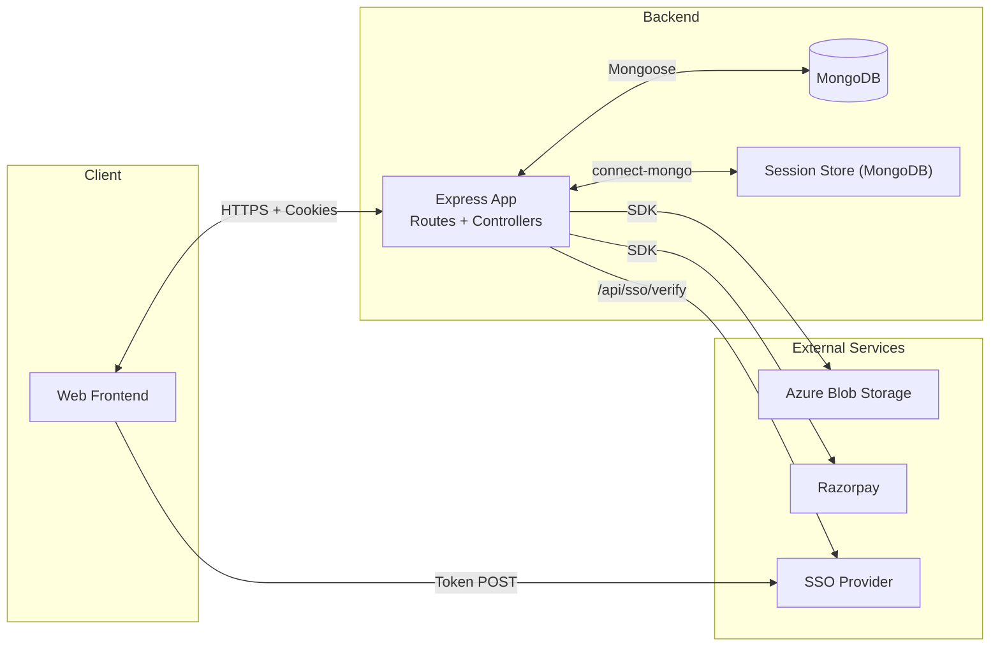
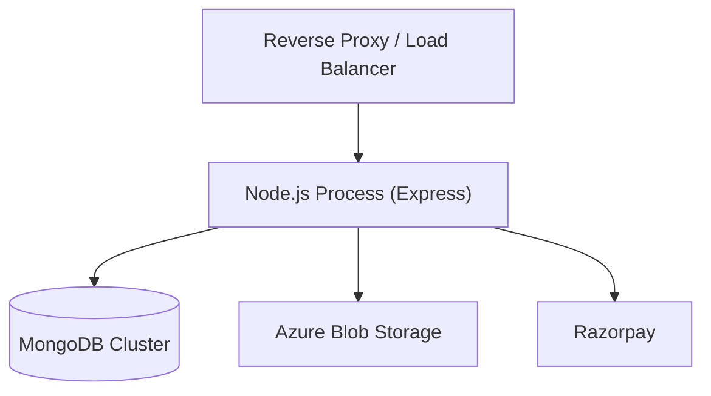
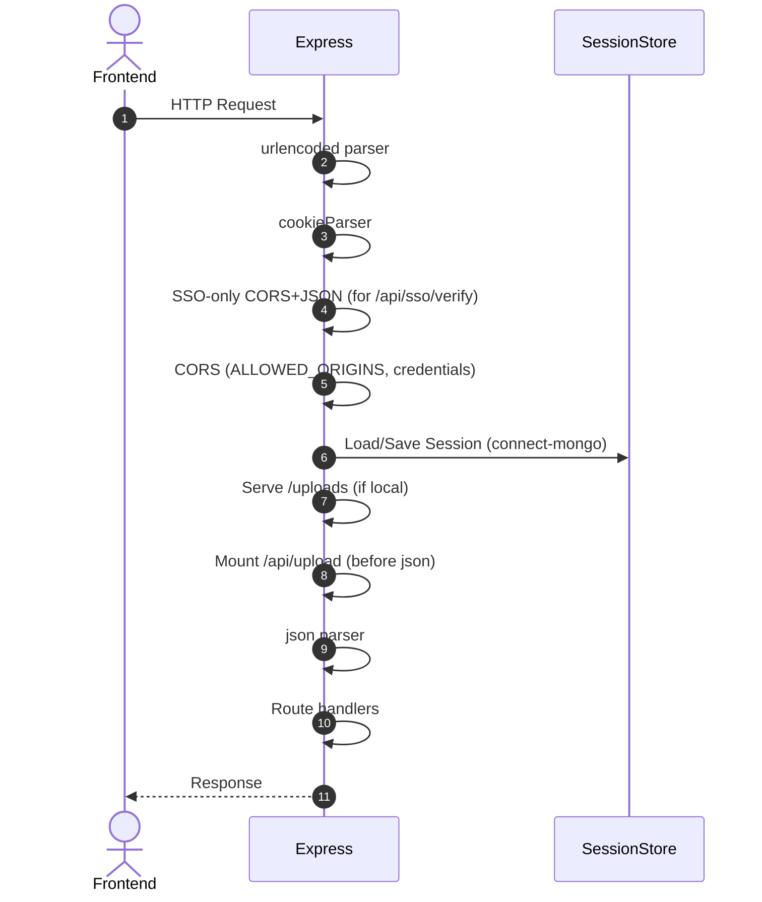
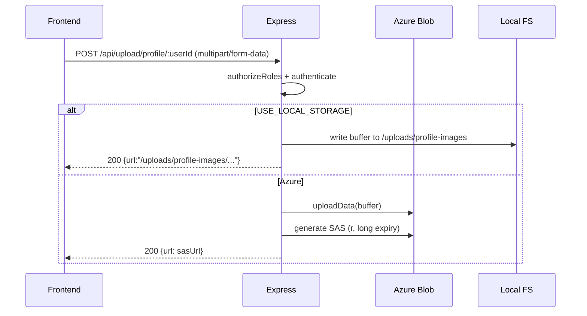
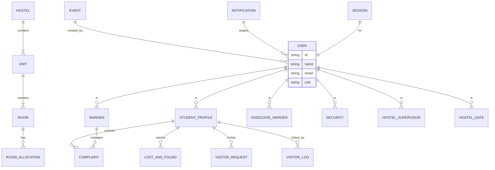

## Software Requirements Specification (SRS)

### Hostel Management System (HMS) – Backend API

Version: 2.0  
Date: 2025-08-10

### Revision History

- 1.0 (2024-08-02): Initial SRS
- 2.0 (2025-08-10): Fully revised to match implemented backend: session-based auth, RBAC/permissions, Azure uploads, Razorpay payments, external API, deployment and detailed diagrams

## Table of Contents

1. Introduction
   - 1.1 Purpose
   - 1.2 Scope
   - 1.3 Definitions, Acronyms, Abbreviations
   - 1.4 References
   - 1.5 Overview
2. Overall Description
   - 2.1 Product Perspective
   - 2.2 Architectural Overview (with diagrams)
   - 2.3 Product Functions
   - 2.4 User Characteristics
   - 2.5 Constraints
   - 2.6 Assumptions and Dependencies
3. Detailed Architecture
   - 3.1 Runtime and Deployment Architecture
   - 3.2 Request Lifecycle and Middleware Order
   - 3.3 Authentication and Session Management
   - 3.4 Authorization and RBAC Permissions Model
   - 3.5 File Uploads and Storage (Azure/local)
   - 3.6 Payments (Razorpay)
   - 3.7 External API Gateway
   - 3.8 Configuration Management
   - 3.9 Logging and Error Handling
   - 3.10 Security Posture
4. Functional Requirements
   - 4.1 Auth & Session
   - 4.2 Core Modules (Student, Warden, Admin, Security, Super Admin)
   - 4.3 Supporting Modules (Complaints, Lost & Found, Events, Visitors, Feedback, Notifications, Stats, Inventory, Tasks, Undertakings, Staff Attendance, Family Members, Dashboard, Config)
   - 4.4 Payments
   - 4.5 Uploads
   - 4.6 External API
5. Non-Functional Requirements
6. Interface Requirements
   - 6.1 Software Interfaces
   - 6.2 Communication Interfaces
7. Data Model & Database Requirements
   - 7.1 Data Entities Overview
   - 7.2 Key Schemas
   - 7.3 Indexing & Integrity
   - 7.4 ER Diagram
8. API Surface Overview
   - 8.1 Route Namespaces
   - 8.2 High-Level Route Map (diagram)
9. Appendices

---

## 1. Introduction

### 1.1 Purpose

This SRS defines the backend API for the Hostel Management System (HMS). It captures implemented behavior and design so engineering, QA, security, and stakeholders share a single, accurate reference.

### 1.2 Scope

Backend API built with Node.js and Express, using MongoDB via Mongoose. It supports:

- Authentication (email/password, Google, SSO) and server-side sessions
- Role-based access and fine-grained permissions
- Student, Warden, Admin, Security, Super Admin modules
- Complaints, Lost & Found, Events, Visitors, Feedback, Notifications, Stats
- Hostel/Rooms, Inventory, Tasks, Undertakings, Staff attendance, Family members
- File uploads to Azure Blob Storage or local filesystem
- Razorpay payment link creation and status checks
- External API namespace for integrations

### 1.3 Definitions, Acronyms, Abbreviations

- HMS: Hostel Management System
- RBAC: Role-Based Access Control
- SSO: Single Sign-On
- CORS: Cross-Origin Resource Sharing
- TTL: Time To Live (expiry)
- SAS: Shared Access Signature (Azure Blob Storage)

### 1.4 References

- Codebase: `server.js`, `routes/*`, `controllers/*`, `models/*`, `middlewares/*`, `externalApi/*`
- Express, Mongoose, connect-mongo, express-session
- Razorpay Node SDK
- Azure Storage Blob SDK

### 1.5 Overview

The document explains architecture and behavior first, then enumerates requirements, interfaces, and data models with diagrams.

---

## 2. Overall Description

### 2.1 Product Perspective

The API is the central service in a client–server architecture. A separate frontend consumes REST endpoints over HTTPS. Data persists in MongoDB; sessions are stored in MongoDB via `connect-mongo`. Files are stored in Azure Blob Storage or local disk (configurable). Payments integrate with Razorpay.

### 2.2 Architectural Overview (with diagrams)

#### Deployment View

#### Request Lifecycle & Middleware Order

As implemented in `server.js`:

1. express.urlencoded → cookieParser → SSO-only CORS+verify handler → CORS with credentials → express-session (connect-mongo) → static `/uploads` (if local) → mount `/api/upload` → express.json → mount remaining routes

### 2.3 Product Functions

- Server-side session login (email/password, Google, SSO)
- RBAC by role plus permission map
- CRUD around students, rooms, hostels, visitors, lost & found, complaints, events, notifications, feedback, stats
- File upload for profile images and student ID cards
- Razorpay payment link creation and status fetch
- External API namespace for integrations

### 2.4 User Characteristics

- Students: Basic web skills
- Wardens/Admin/Security: Basic web skills
- Super Admin: Intermediate (system configuration)

### 2.5 Constraints

- Node.js runtime, Express framework
- MongoDB database
- Session cookies with secure attributes in production
- Azure Blob Storage if not using local storage
- Razorpay account/keys for payments

### 2.6 Assumptions and Dependencies

- Valid user accounts exist (provisioned via Admin flows)
- External services (Azure, Razorpay, SSO provider) are reachable
- Frontend is hosted with allowed origins configured

---

## 3. Detailed Architecture

### 3.1 Runtime and Deployment Architecture

- Single Express application (`server.js`) mounting routers under `/api/*` and `/external-api`
- Session management using `express-session` with `connect-mongo` store
- Sessions TTL: 7 days; cookies `httpOnly`, `secure` in non-dev, `sameSite` None in non-dev
- Special SSO verification path `/api/sso/verify` uses open-origin CORS and no credentials

### 3.2 Request Lifecycle and Middleware Order

See sequence above. The upload routes are mounted before `express.json()` to support multipart handling via `multer` memory storage.

### 3.3 Authentication and Session Management

- Email/password login: `POST /api/auth/login`
- Google login: `POST /api/auth/google` (verifies id_token with Google)
- SSO verification: `POST /api/auth/verify-sso-token` and `POST /api/sso/verify`
- Current user: `GET /api/auth/user` (requires session)
- Logout: `GET /api/auth/logout` (destroys session and clears cookie)
- Refresh user data: `GET /api/auth/refresh`
- Device sessions listing and remote logout: `GET /api/auth/user/devices`, `POST /api/auth/user/devices/logout/:sessionId`

Session details:

- On successful login/SSO/Google: `req.session.userId`, `role`, `email`, and an `userData` cache with `_id, email, role, permissions (object), hostel`
- A `Session` collection tracks device sessions (`userId`, `sessionId`, user agent, ip, device name, login/lastActive`)

### 3.4 Authorization and RBAC Permissions Model

- Roles: `Student`, `Maintenance Staff`, `Warden`, `Associate Warden`, `Admin`, `Security`, `Super Admin`, `Hostel Supervisor`, `Hostel Gate`
- Role checks via `authorizeRoles([...])`
- Fine-grained permissions via a Map on `User.permissions`, with resources like `students_info`, `lost_and_found`, `events`, `visitors`, `complaints`, `feedback`, `rooms`, `hostels`, `users`, etc., each with actions `view|edit|create|delete|react`
- Middleware `requirePermission(resource, action)` uses `hasPermission` to allow/deny

### 3.5 File Uploads and Storage (Azure/local)

- Endpoints (authenticated):
  - `POST /api/upload/profile/:userId` (roles: Admin, Warden, Associate Warden, Hostel Supervisor, Student)
  - `POST /api/upload/student-id/:side` (role: Student)
- `multer` in-memory, then either:
  - Local disk at `uploads/` (when `USE_LOCAL_STORAGE=true`) and served from `/uploads`
  - Azure Blob Storage: uploaded via SDK and returns a long-lived read SAS URL (read-only)

### 3.6 Payments (Razorpay)

- `POST /api/payment/create-link` (Admin) creates a payment link for an amount (INR); returns `short_url` and `id`
- `GET /api/payment/status/:paymentLinkId` (authorized roles + `requirePermission('visitors','view')`) fetches payment link status

### 3.7 External API Gateway

- Mounted under `/external-api`
- Provides integration endpoints mirroring core domain (associate warden, complaints, events, etc.)
- Separate `externalApi/middleware/apiAuth.js` may enforce API client auth (see codebase for details)

### 3.8 Configuration Management

- Configs stored in `models/configuration.js` with controller/utilities (`utils/configDefaults.js`) that auto-create defaults:
  - `degrees`, `departments`, `studentEditableFields`
- Utility `initializeDefaultConfigs()` ensures defaults are present

### 3.9 Logging and Error Handling

- Console logging for startup, DB connections, and errors in controllers
- Errors returned as JSON with appropriate HTTP status codes

### 3.10 Security Posture

- HTTPS recommended for all environments
- CORS: general routes use `ALLOWED_ORIGINS` with `credentials: true`; SSO verify route uses `origin: '*'` and `credentials: false`
- Sessions: `httpOnly`, `secure` in production, `sameSite: 'None'` in production; TTL 7 days; store crypto with `SESSION_SECRET`
- Passwords hashed via `bcrypt` with salt
- Sensitive configuration via environment variables

---

## 4. Functional Requirements

### 4.1 Auth & Session

- FR-A1: Users can log in via email/password
- FR-A2: Users can log in via Google ID token
- FR-A3: Users can verify SSO token from SSO provider
- FR-A4: Successful auth initializes a server-side session and sets secure cookie
- FR-A5: Authenticated users can fetch their profile (`/api/auth/user`) and refresh server-cached userData
- FR-A6: Users can update their password (when a password exists)
- FR-A7: Users can view and revoke device sessions
- FR-A8: Users can log out, destroying their session and clearing the cookie

### 4.2 Core Modules

Namespaces mounted under `/api/*` include (non-exhaustive): `auth`, `warden`, `student`, `admin`, `complaint`, `security`, `lost-and-found`, `event`, `hostel`, `stats`, `feedback`, `visitor`, `notification`, `disCo`, `payment`, `super-admin`, `family`, `staff`, `inventory`, `permissions`, `dashboard`, `tasks`, `users`, `config`, `student-profile`, `sso`, `undertaking`

Each module provides CRUD and actions consistent with the domain. Access is enforced via `authenticate`, `authorizeRoles`, and selectively `requirePermission`.

### 4.3 Supporting Modules

- Complaints: submission, assignment, status workflow
- Lost & Found: lost/found item lifecycle
- Events: create, list
- Visitors: log entry/exit
- Feedback: submit, view
- Notifications: create, list (role-targeted)
- Stats: dashboard aggregates
- Inventory & Student Inventory: track hostel and student items
- Tasks, Undertakings, Staff Attendance, Family members, Dashboard, Config management

### 4.4 Payments

- FR-P1: Admin can generate payment link via Razorpay
- FR-P2: System can fetch payment link status

### 4.5 Uploads

- FR-U1: Authenticated users can upload profile images (role-restricted)
- FR-U2: Students can upload front/back of student ID cards
- FR-U3: System returns accessible URL (local or Azure SAS)

### 4.6 External API

- FR-E1: Provide integration endpoints under `/external-api`
- FR-E2: Enforce API-level authorization for clients (per `apiAuth` middleware)

---

## 5. Non-Functional Requirements

- Performance: typical GET APIs under 2s; login under 3s under normal load
- Availability: recommended 99.5%+ with proper infra
- Security: HTTPS-only, secure cookies, salted password hashes, CORS restrictions, principle of least privilege
- Reliability: database connection retries; session TTL cleanup via MongoDB TTL indexes
- Maintainability: modular routes/controllers/models; documentation in `/docs`

---

## 6. Interface Requirements

### 6.1 Software Interfaces (Environment Variables)

From `config/environment.js`:

- `NODE_ENV`, `PORT`
- `JWT_SECRET` (used by SSO token verification helper)
- `SESSION_SECRET`
- `MONGO_URI`
- `AZURE_STORAGE_CONNECTION_STRING`
- `AZURE_STORAGE_CONTAINER_NAME`
- `AZURE_STORAGE_ACCOUNT_NAME`
- `AZURE_STORAGE_ACCOUNT_KEY`
- `AZURE_STORAGE_CONTAINER_NAME_STUDENT_ID`
- `RAZORPAY_KEY_ID`, `RAZORPAY_KEY_SECRET`
- `ALLOWED_ORIGINS` (comma-separated)
- `USE_LOCAL_STORAGE` ("true" to enable local file storage)

### 6.2 Communication Interfaces

- REST over HTTPS; JSON request/response bodies (multipart for uploads)
- CORS: configured per `server.js` (SSO verify route is open-origin without credentials)

---

## 7. Data Model & Database Requirements

### 7.1 Data Entities Overview

Implemented models include (selection): `User`, `StudentProfile`, `Warden`, `AssociateWarden`, `Security`, `HostelSupervisor`, `HostelGate`, `Hostel`, `Unit`, `Room`, `RoomAllocation`, `RoomChangeRequest`, `Complaint`, `DisCoAction`, `LostAndFound`, `Event`, `Notification`, `VisitorProfile`, `VisitorRequest`, `Visitors`, `CheckInOut`, `MaintenanceStaff`, `HostelInventory`, `InventoryItemType`, `StudentInventory`, `Task`, `Undertaking`, `UndertakingAssignment`, `Health`, `InsuranceProvider`, `InsuranceClaim`, `ApiClient`, `Poll`, `Session`, `FamilyMember`, `configuration`

### 7.2 Key Schemas

- `User`:
  - `name`, `email` (unique), `phone`, `profileImage`
  - `role` (enum listed in 3.4)
  - `permissions` Map: resource → {view, edit, create, delete, react}
  - `password` (nullable), `aesKey`
  - Virtual `hostel` references role-specific host document by `userId`

### 7.3 Indexing & Integrity

- Create indexes for frequent lookups (e.g., `User.email`, complaint status)
- Maintain referential integrity for role-linked hostels and allocations

### 7.4 ER Diagram (High-Level)

---

## 8. API Surface Overview

### 8.1 Route Namespaces (mounted in `server.js`)

- `/api/auth`
- `/api/warden`
- `/api/student`
- `/api/admin`
- `/api/complaint`
- `/api/security`
- `/api/lost-and-found`
- `/api/event`
- `/api/hostel`
- `/api/stats`
- `/api/feedback`
- `/api/visitor`
- `/api/notification`
- `/api/disCo`
- `/api/payment`
- `/api/super-admin`
- `/api/family`
- `/api/staff`
- `/api/inventory`
- `/api/permissions`
- `/api/dashboard`
- `/api/tasks`
- `/api/users`
- `/api/config`
- `/api/student-profile`
- `/api/sso`
- `/api/undertaking`
- `/api/upload` (mounted before json)
- `/external-api`

### 8.2 High-Level Route Map

```mermaid
graph TD
  A[/server.js/] -->|mount| AU[/api/auth/]
  A --> WA[/api/warden/]
  A --> ST[/api/student/]
  A --> AD[/api/admin/]
  A --> CP[/api/complaint/]
  A --> SC[/api/security/]
  A --> LF[/api/lost-and-found/]
  A --> EV[/api/event/]
  A --> HO[/api/hostel/]
  A --> STS[/api/stats/]
  A --> FB[/api/feedback/]
  A --> VI[/api/visitor/]
  A --> NO[/api/notification/]
  A --> DC[/api/disCo/]
  A --> PM[/api/payment/]
  A --> SA[/api/super-admin/]
  A --> FM[/api/family/]
  A --> SF[/api/staff/]
  A --> IN[/api/inventory/]
  A --> PRM[/api/permissions/]
  A --> DB[/api/dashboard/]
  A --> TK[/api/tasks/]
  A --> USR[/api/users/]
  A --> CFG[/api/config/]
  A --> SP[/api/student-profile/]
  A --> SSO[/api/sso/]
  A --> UND[/api/undertaking/]
  A --> UP[/api/upload/]
  A --> EXT[/external-api/]
```

---

## 9. Appendices

### 9.1 Security Checklist

- Enforce HTTPS end-to-end
- Set `ALLOWED_ORIGINS` precisely; avoid `*` except for the dedicated SSO verify route
- Keep `SESSION_SECRET` long and random; rotate if leaked
- Ensure `secure` cookies in production; `sameSite: 'None'`
- Validate and sanitize inputs for all endpoints
- Store credentials and keys only in environment variables and secret stores

### 9.2 Operations Notes

- Session store uses MongoDB with TTL; monitor collection size and TTL indexes
- Azure Blob containers must exist and be configured; SAS expiry is set far in the future for read-only links
- Razorpay API keys must be scoped and rotated per org policy

### 9.3 Future Enhancements

- Add rate limiting (per-IP and per-user)
- Centralized structured logging and correlation IDs
- Webhooks for payment confirmations
- Background jobs for notifications and cleanup

---

This SRS reflects the current backend implementation and is intended to evolve alongside the codebase.
